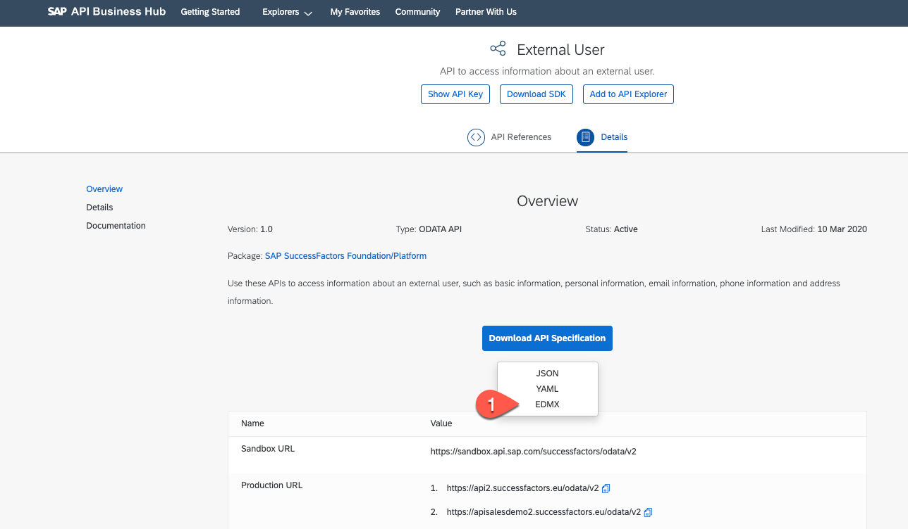
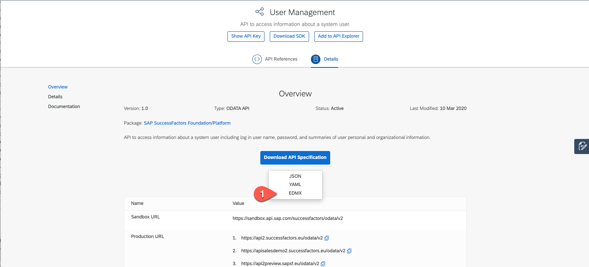
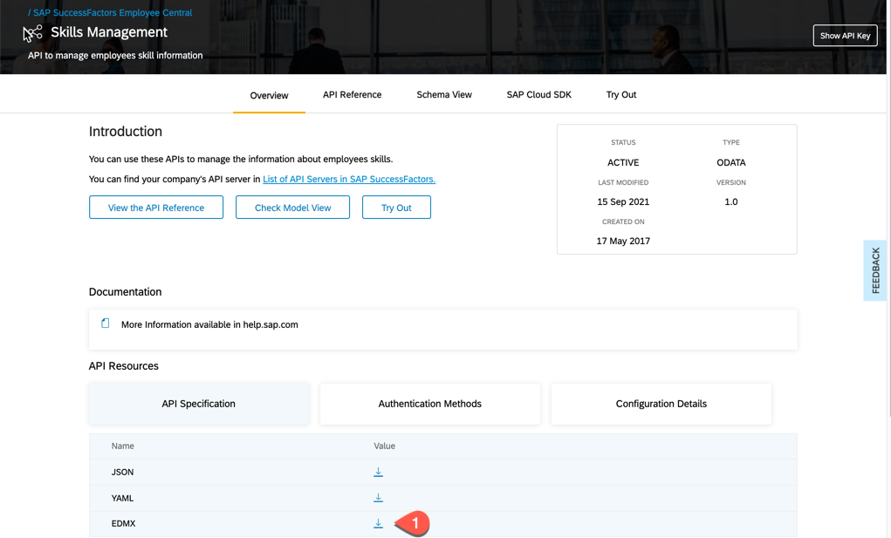

# Identify SuccessFactors API in SAP API Business Hub

## Introduction
 In this section we will search for 3 different SuccessFactors API in SAP API Business Hub and also download the relevant Entity Data Model XML files (EDMX File). 
 
**Personas:** SAP Cloud Developer

## Step-by-Step	

In SAP API Business Hub you can discover and consume digital content packages with APIs and pre-packaged integrations from SAP and select partners. Let us search and find the SuccessFactors APIs. We will download the Entity Data Model XML files for 3 different SuccessFactor APIs.

1.	Open a browser window and open [SAP API Business Hub](https://api.sap.com/).
2. In the Search bar, search for 'External User'.
3. Click on the search result 'External User' API from SAP SuccessFactors Foundation/Platform.
4. Click on the tab 'Details'.	
5. Click the button 'Download API Specification' and choose 'EDMX'. 

    
   
6. You get a popup to login,Login to API Business Hub to download the EDMX file to your local folder.

    
   
7. 	Go back to the homepage of 'SAP API Business Hub' and search for 'User Management' in the Search bar.
8. Click on the search result 'User Management' API from SAP SuccessFactors Foundation/Platform.
9. Click on the tab 'Details'.	
10. Click the button 'Download API Specification' and choose 'EDMX' to download the EDMX file to your local folder.

     
    
11. Go back to the homepage of 'SAP API Business Hub' and search for 'Skills Management' in the Search bar.
8. Click on the search result 'Skills Management' API from SAP SuccessFactors Foundation/Platform.
9. Click on the tab 'Details'.	
10. Click the button 'Download API Specification' and choose 'EDMX' to download the EDMX file to your local folder.

     

### Result
You have now successfully downloaded the Entity Data Model XML files for 3 different SuccessFactor APIs to be used for Extension Application Development in the next steps.
