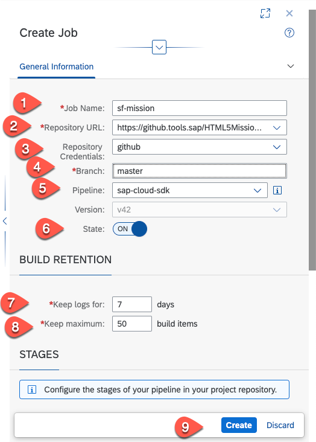

# Creating a CI/CD pipeline for the cloud application

## Introduction

In this section, we describe steps how to configure and run predefined continuous integration and delivery (CI/CD) pipelines that automatically test, build, and deploy your code changes to speed up your development and delivery cycles.

**Persona:** SCP Administrator / SCP Developer


## Step-by-Step


### Create Github Repository

This step describes how to create a Github repository in which you can store the source code of your project. You need to have a user in the public GitHub to execute the steps below.

1. Open your github home page.
2. Click on *New* in the 'Repository' tab to create a new repository.

   
   
3. Enter the name of the repository. For example, ‘extendUI’. Do not check the checkbox 'Intialize this repository with a README'.
4. Click on create repository.

    

5. Copy the github url of the newly created Git repository.

   
   

   
### Generating OAuth Token

1. As the public Git hub announced deprecation of Basic Authentication, we have described steps to login with the Access tokens to the Git.
2. Refer to the public Git Hub link and create a [Personal Access Token](https://docs.github.com/en/github/authenticating-to-github/creating-a-personal-access-token).
3. You can use these Access tokens when you want to use Git commands instead of giving Git password.

### Add Git repository to CAP project

1. Login to your SAP Cloud Platform account. 
2. Goto your Subaccount and click on Subscriptions. 
3. Search for **Business Application Studio** and click on 'Go to Application'. 
   
    
   
4. You would be prompted with a login screen of the custom Identity Provider what you have configured.
5. Login to the Application using your custom Identity Provider credentials.
6. Open the previously created workspace with the CAP application.
7. Open a new terminal and navigate to project root folder.

    
   
8. Enter your email address and User name to be used by Git. You can use the email address which you have used to register the Git account.
   ```
   git config --global user.email "you@example.com"
   git config --global user.name "Your Name"
   ```
7. Now we are initializing a Git repository which can be used to convert an existing, unversioned project to a Git repository or initialize a new, empty repository. To use  other Git commands, you need an initialized repository, so this is usually the first command you'll run in a new project. Let us run the following commands:

	```
    git init
    git add .
    git commit -m "Push project content to github"
    ```
   
    
8. Now take the copied Git Repository URL which you created and copied in step 5 of 'Creating GitHub Repository' and add this URL pointing as the remote repository.

   ```
   git remote add origin <copied Git repository url.git>
   ```
    
9. Let us push the commit with project contents to this Git Repository.
    
   ```
   git push -u origin master
   ```
    
10. When prompted, enter your Git Username and Password (or Token).
    
    


  
### Continuous Integration and Delivery pipeline setup

1. In your subaccount in the SAP Cloud Platform cockpit, choose Subscriptions.
2. Search for “Continuous Integration” and Click on “Continuous Integration & Delivery”
4. Click “Subscribe”, if you have not already subscribed and click on “Go to Application”.

   

5. Login to the CI/CD application using the company identity provider account credentials.
6. In the next step, we will configure credentials for connecting SAP Cloud Platform Continuous Integration and Delivery to other services like Git and Cloud Accounts.

7. Let us create Credentials to connect to GitHub to clone the sources. This step is only needed if your GitHub repository is private else you can skip this step.
  - Choose the ‘Credentials’ tab and click '+'. For the user name, enter your Github user name. 
  - For 'Type', select 'Basic Authentication'.
  - For 'Password', use the personal access token which you created in the Github in previous step. 

     
   
8. In the Credentials tab, choose '+' (Create Credentials) to configure credentials of a Cloud Platform user, who has the appropriate permissions. The user must have the Space Developer role and also be a member of the specified Cloud Foundry organization and space. 
We recommend using a technical user. However, you can use also use your cloud credentials. 
  - Enter a name for the cloud credentials, ex: cloud-credentials
  - Type: Choose 'Basic Authentication'
  - Username: Enter your SAP Cloud Platform email id
  - Password: Enter your SAP Cloud Platform user password

   

### Create Pipeline in CAP Project

1. Go back to your project in SAP Business Application Studio

2. Open a terminal and go to the root folder of your project.

3.  In the file genernated (.pipeline -> .config.yml), replace the content with the following:


   ```yaml
   
    ### General project setup
    general:
    unsafeMode: false
    projectName: 'cloud-cap-s4ems-bp'
    productiveBranch: 'master'

    ### Step-specific configuration
    steps:
    artifactPrepareVersion:
        buildTool: 'mta'
    npmExecute:
        dockerImage: 'ppiper/node-browsers:v2'
    cloudFoundryDeploy:
        dockerImage: 'ppiper/cf-cli'
        mtaDeployParameters: '-f --version-rule ALL'
    sapNexusStage:
        stagingProfile: 'integration'
        repositoryFormat: 'npm'
    sapNexusUploadArtifacts:
        packaging: 'mtar'
        buildDescriptorFile: 'mta.yaml'
        uploadFile: 'cloud-sf-extension-cap-sample_1.0.0.mtar'
        artifactType: 'mta'
    mtaBuild:
        mtaBuildTool: ""cloudMbt""


    ### Stage-specific configuration
    stages:
    npmAudit:
        auditedAdvisories:
        # high
        - 550  
        - 593
        - 1184
        - 755
        - 1065
        - 1164
        - 1316
        - 1324
        - 1325
        # moderate
        - 535
        - 1300
    
    lint:
        ui5BestPractices:
        failThreshold:
            error: 100
            warning: 500
            info: 1000
        
    productionDeployment:
        cfTargets:
        - org:  '<org_name>'
            space: '<space_name>'
            appName: 'cloud-sf-extension-cap-sample'
            apiEndpoint: 'https://api.cf.eu10.hana.ondemand.com'
            credentialsId: '<credential_id>'
      
   ```

4. "Modify the paraters in .pipeline/config.yml with contents specific to your subaccount :
  
    * org: '\<org_name\>'
    * space: '\<space_name\>'
    * appName: '\<appName\>'
    * apiEndpoint: '\<api end point\>'
    * credentialsId: '\<global cloud credential id in the CI/CD service created in step 8 in the section before e.g: cloud-credentials\>'

5. You find the parameters in your SAP Cloud Platform subaccount overview. Copy the API Endpoint, Org Name 

    
    
6. Choose 'Spaces' and copy the space name.

    

### Setup CI/CD Job
  
1. Back to the CI/CD service. Choose the 'Jobs' tab and ‘+’ icon to create a new job.
2. In the next screen, enter the following inputs :
    
    - Job Name: For example, 'cloud-extension-sf-sample'
    - Repository URL: Enter the Github repository URL used in previous section.
    - Repository credentials : \<Choose the GitHub credential you've created\>
    - Branch: master
    - Pipeline: sap-cloud-sdk
    - Version: latest or leave the default
    - Build retention: Keep the Logs : 7 days
    
    
    
3. Click Create
    
4.  If you create the first job in a repository, the Webhook Creation pop-up appears. It provides you with the data you need to define a webhook in GitHub. Copy the 'Payload URL' and the 'Secret' into a text editor of your choice.
   
     
    
5. Open your Github repository and choose 'Settings' --> 'Hooks' --> 'Add webhook'.

    
    
6. For the 'Payload URL' and 'Secret', copy and paste the payload URL and secret from step 4.

    
    
7. For 'Content Type', select 'application/json' and configure the job to be triggered for every 'Push' event and choose 'Add Webhook'. Now, any new push request to this repository triggers the CI/CD pipeline you have created.

8. To trigger the pipeline manually, go back to the CI/CD pipeline and choose the ‘Run’ icon as shown below. 

    
    
9. You can see the successful log results of 'Build' and 'Deploy'. To view the full log file, click on the respective tile.
	
       


### Result
You have successfully configured and added a Continous Integration / Continous Delivery pipeline to your cloud application.

### Related Links
- [Git Basic Authentication](https://developer.github.com/enterprise/2.20/v3/auth/#basic-authentication)
- [Deprecating password authentication](https://developer.github.com/changes/2020-02-14-deprecating-password-auth/)
- [Git - Initializing a repository](https://www.atlassian.com/git/tutorials/setting-up-a-repository/git-init)
- [Assigning Roles and Permissions for SAP Cloud Platform Continous Integration and Delivery](https://help.sap.com/viewer/99c72101f7ee40d0b2deb4df72ba1ad3/Cloud/en-US/c679ebdbe76142bd9fb1071e5e53511d.html)