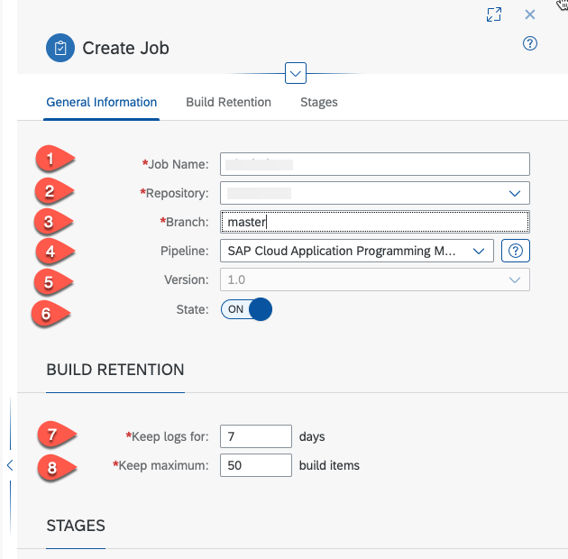

# Creating a CI/CD pipeline for the cloud application

## Introduction

In this section, we describe steps how to configure and run predefined continuous integration and delivery (CI/CD) pipelines that automatically test, build, and deploy your code changes to speed up your development and delivery cycles.

**Persona:** Cloud Administrator / Cloud Application Developer
**Abbreviation:** SAP Business Technology Platform = SAP BTP


## Step-by-Step


### Create GitHub Repository

This step describes how to create a GitHub repository in which you can store the source code of your project. You need to have a user in the public GitHub to execute the steps below.

1. Open your GitHub home page.
2. Choose *New* in the 'Repositories' tab to create a new repository.

   
   
3. Enter the name of the repository. For example, **extendUI**. Do not select the checkbox **Intialize this repository with a README**.
4. Choose create repository.

    

5. Copy the GitHub URL of the newly created Git repository.

   
   

   
### Generating OAuth Token

1. As the public Git hub announced deprecation of Basic Authentication, we have described steps how to login with the Access tokens to the Git.
2. Refer to the public Git Hub link and create a [Personal Access Token](https://docs.github.com/en/github/authenticating-to-github/creating-a-personal-access-token).
3. You can use these Access tokens when you want to use Git commands instead of giving Git password.

### Add Git repository to CAP project

1. Login to your SAP BTP global account. 
2. Goto your subaccount and choose **Instances andd Subscriptions**. 
3. In the **Subscriptions** section search for **SAP Business Application Studio** and choose **Go to Application**. 
   
    
   
4. When prompted log into the Application using your custom Identity Provider credentials.
5. Open the previously created workspace with the CAP application.
6. Open a new terminal and navigate to project root folder.

    
   
7. Enter your email address and user name. You can use the email address which you have used to register the GitHub account.
   ```
   git config --global user.email "you@example.com"
   git config --global user.name "Your Name"
   ```
8. Now we are initializing a Git repository which can be used to convert an existing, unversioned project to a Git repository or initialize a new, empty repository. To use  other Git commands, you need an initialized repository, so this is usually the first command you'll run in a new project. Use the following commands:

	```
    git init
    git add .
    git commit -m "Push project content to GitHub"
    ```
   
    
9. Now take the copied GitHub Repository URL which you created and copied in step 5 of 'Creating GitHub Repository' and add this URL pointing as the remote repository.

   ```
   git remote add origin <copied Git repository url.git>
   ```
    
10. Push the commit with project contents to the default branch of this GitHub repository. Check in your GitHub repository if your default branch is master or main.
    
   ```
   git push -u origin main
   ```
    
11. When prompted, enter your GitHub username and Password (or token).
    
    


  
### Set up Continuous Integration and Delivery Pipeline 

1. In your subaccount in the SAP BTP cockpit, choose **Instances and Subscriptions**.
2. Search for **Continuous Integration & Delivery** and select **Go to Application**.

   

4. Login to the Continuous Integration & Delivery application using the company identity provider account credentials.
5. In the next step, we will configure credentials for connecting SAP Continuous Integration and Delivery to other the cloud accounts.
Let us create Credentials to connect to GitHub to clone the sources. This step is only needed if your GitHub repository is private else you can skip this step.
  - Choose the **Credentials** tab and then choose **+**. For the user name, enter your Github user name. 
  - For **Type**, select **Basic Authentication**.
  - In the **Username** field enter your GitHub user.
  - For **Password**, use the personal access token which you created in your GitHub account in the previous section. 

     
6. In the Credentials tab, choose **+** (Create Credentials) to configure credentials of a SAP BTP user, who has the appropriate permissions. The user must have the Space Developer role and also be a member of the specified Cloud Foundry organization and space. 
We recommend using a technical user. However, you can use also use your cloud credentials. 
  - Enter a name for the cloud credentials, ex: cloud-credentials
  - **Type**: Choose **Basic Authentication**
  - In the **Username** field enter your SAP BTP email id
  - In the **Password** field enter your SAP BTP user password

   

### Create Pipeline in CAP Project

1. Go back to your project in SAP Business Application Studio

2. Open a terminal and go to the root folder of your project.
3. Create a pipeline file using the following command in your terminal.

   ```
   cds add pipeline
   ```

4.  In the file generated (.pipeline -> .config.yml), replace the content with the following - for the **productiveBranch** parameter set your default GitHub repository branch (in general master or main)


   ```yaml
   
    ### General project setup
    general:
    unsafeMode: false
    projectName: 'cloud-cap-s4ems-bp'
    productiveBranch: 'main'

    ### Step-specific configuration
    steps:
    artifactPrepareVersion:
        buildTool: 'mta'
    npmExecute:
        dockerImage: 'ppiper/node-browsers:v2'
    cloudFoundryDeploy:
        dockerImage: 'ppiper/cf-cli'
        mtaDeployParameters: '-f --version-rule ALL'
    sapNexusStage:
        stagingProfile: 'integration'
        repositoryFormat: 'npm'
    sapNexusUploadArtifacts:
        packaging: 'mtar'
        buildDescriptorFile: 'mta.yaml'
        uploadFile: 'cloud-sf-extension-cap-sample_1.0.0.mtar'
        artifactType: 'mta'
    mtaBuild:
        mtaBuildTool: "cloudMbt"


    ### Stage-specific configuration
    stages:
    npmAudit:
        auditedAdvisories:
        # high
        - 550  
        - 593
        - 1184
        - 755
        - 1065
        - 1164
        - 1316
        - 1324
        - 1325
        # moderate
        - 535
        - 1300
    
    lint:
        ui5BestPractices:
        failThreshold:
            error: 100
            warning: 500
            info: 1000
        
    productionDeployment:
        cfTargets:
        - org:  '<org_name>'
            space: '<space_name>'
            appName: 'cloud-sf-extension-cap-sample'
            apiEndpoint: 'https://api.cf.eu10.hana.ondemand.com'
            credentialsId: '<credential_id>'
      
   ```

5. "Modify the parameters in .pipeline/config.yml with values specific to your subaccount :
  
    * **org**: Org name of your SAP BTP subaccount, you find this in your subaccount overview page
    * **space**: Name of the space where you want deploy the application
    * **appName**: Name of the application
    * **apiEndpoint**: API Entpoint, you find this in your subaccount overview page 
    * **credentialsId**: Name of the SAP BTP credential created in the CI/CD service in step 6 in the section before.
      
      
    
      Choose 'Spaces' and copy the space name.

      
    
6. Save the .config.yml file. You can push the modified contents of the project into the Git repository to your default branch (master or main).

   ```
   git add .
   git commit -m "Push changes to my project"
   git push -u origin main
   
   ```

### Set up Continuous Integration & Delivery (CI/CD) Job
  
1. Go back to the SAP Continous Integration & Delivery service. 
2. In the adminstration console select **Repositories**. Choose the **+** icon to create a new repository.
3. In the **Add Repository** screen enter the following values:
   * In the **Name** field set the name for the repository for example: cloud-extension-sf-mission
   * In the **Clone URL** set the clone URL of your GitHub repository
   * In the **Credentials** field choose the credentials for your GitHub repository which you created in step 5 in the first section  - it is necessary for private GitHub repositories.
   * In the **Type** field chosse GitHub
   * In the **Weebhook Credential** field choose **\<GENERATE\>**
   * Keep the **State** field on
   * Choose **Add** to save the repository  
   
   

4. Choose the **Webhook Data** of the created repository

   


5. The Webhook Creation pop-up appears. It provides you with the data you need to define a webhook in GitHub. Copy the **Payload URL** and the **Secret** into a text editor of your choice.
   
     
    
6. Open your GitHub repository and choose **Settings** --> **Hooks** --> **Add webhook**.

    
    
7. For the **Payload URL** and **Secret**, paste the values of the Payload URL and Secret fields you copied and saved in step 5. For **Content Type** field, select **application/json** and configure the job to be triggered for every **Push** event and choose **Add Webhook**. Now, any new push request to this repository triggers the CI/CD pipeline you have created.
   
    

8. Go back to the SAP Continous Integration & Delivery service Choose the **Jobs** tab and **+** icon to create a new job.
9.  In the next screen, enter the following inputs :
    
    - In the **Job Name** field for example 'sf-mission'
    - In the **Repository** field select the repository which we have created in step 3.
    - In the **Branch** field select your default branch (master or main)
    - In the **Pipeline** field select **SAP Cloud Application Programming Model**
    - In the **Version** field select latest or leave the default
    - In the **Build retention** section set **Keep the Logs** = 7 days and **Keep maximum** = 50 build items
    
    
    
10. Choose **Create** to save the job.

21. To trigger the pipeline manually, select the CI/CD job you have created and choose the **Trigger build** icon as shown below. 

    
    
12. You can see the successful log results of **Build** and **Deploy**. To view the full log file, click on the respective tile.
	
       


### Result
You have successfully configured and added a Continuous Integration & Continous Delivery pipeline to your cloud application.

### Related Links
- [Git Basic Authentication](https://developer.github.com/enterprise/2.20/v3/auth/#basic-authentication)
- [Deprecating password authentication](https://developer.github.com/changes/2020-02-14-deprecating-password-auth/)
- [Git - Initializing a repository](https://www.atlassian.com/git/tutorials/setting-up-a-repository/git-init)
- [Assigning Roles and Permissions for SAP Continuous Integration and Delivery](https://help.sap.com/viewer/99c72101f7ee40d0b2deb4df72ba1ad3/Cloud/en-US/c679ebdbe76142bd9fb1071e5e53511d.html)