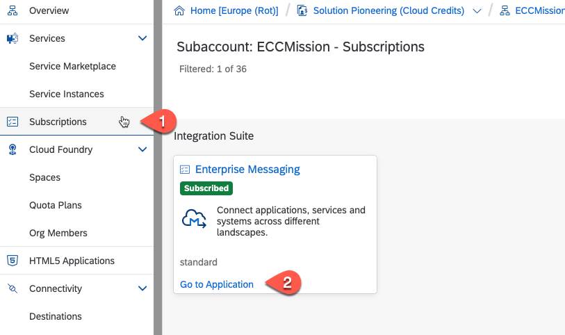
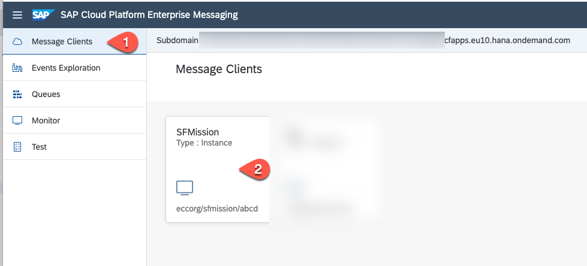
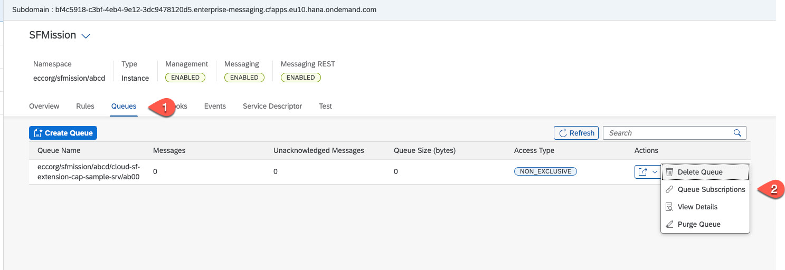
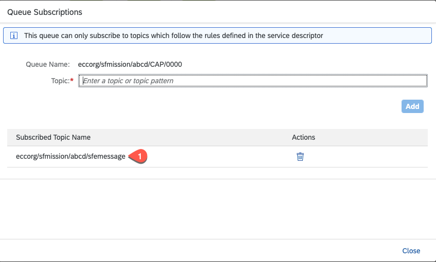
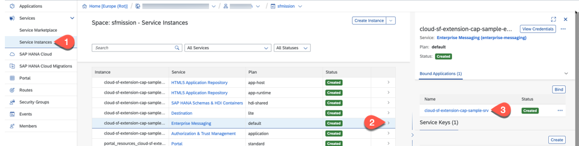
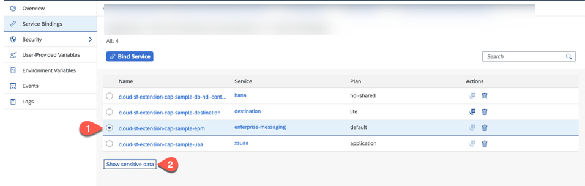
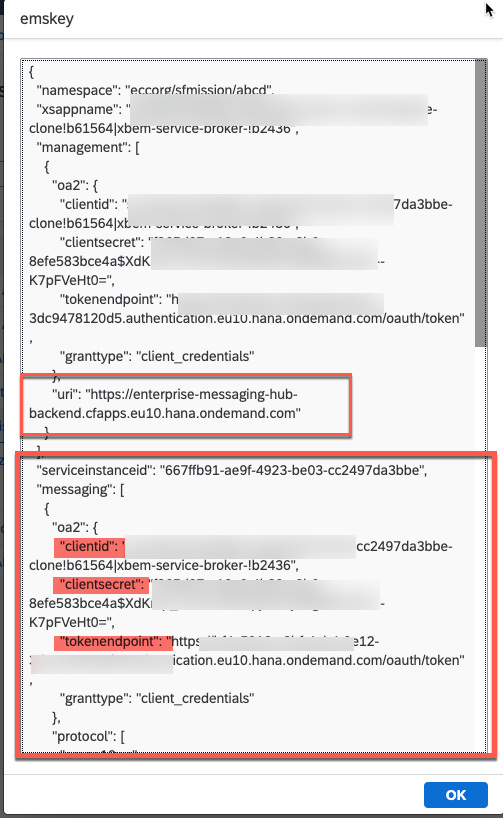

# Event Mesh service: get topic and service key values

For the communication between your SAP SuccessFactors system and the SAP Event Mesh service you need a service key
and some parameter values. 

**Persona:** Cloud Administrator / Cloud Application Developer
**Abbreviation:** SAP Business Technology Platform = SAP BTP

## Get the Topic
The topic for the messaging has been generated when the extension application has been deployed. 

1. In your SAP BTP subaccount select **Instances and Subsriptions** and search for the Event Mesh. Choose **Go to Application**

   

2. Log in to the Event Mesh service. Select **Message Clients** and choose the client which you have defined in the enterpsiemessaging.json in the extension application.
   
   

3. Select Queues and in the Actions of the respective queue, choose Queue Subscriptions.
   
   

4. Copy the value of the Subscribed Topic Name to a file. We will need it for the messaging setup in your SAP SuccessFactors system.

   

## View Service Key

In the previous step, you have deployed the extension application in SAP Cloud Platform, and you have bound it to the Event Mesh service instance. Now, you have to get the service key. To do that: 

1. In your SAP BTP subaccount select **Service Instances**. Expand the Event Mesh instance and click the Name of the bound application. 
   
   

2. Click the radiobutton near **enterprise-messaging** service and click **Show sensitive data** to view the Service Key details.
   
   

3. From the sensitive data, copy the content of the tag **messaging** for protocol **httprest**. Copy the values of the clientid, clientsecret, tokenendpoint and Base url to a file omitting the quotation marks. You will need these values for the messaging connection setup in SAP SuccessFactors.
   
   

