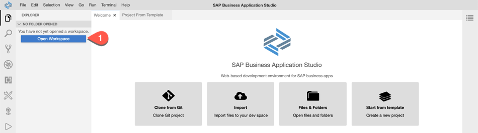
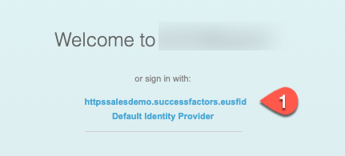
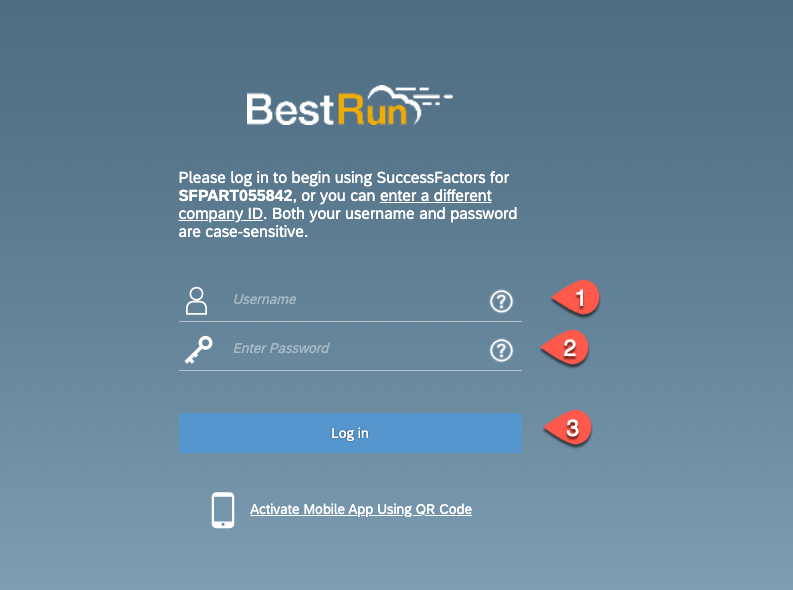

# Configure, build and deploy the Extension Application

In this section we will configure our demo application, create the necessary service instances for the SAP HANA DB, enterprise messaging, security and connectivity. Deploy the application to your SAP Cloud Platform account and run a first test.
 
 The application structure is based on the SAP Cloud Application Programming Model (CAP)
 If you want to know how to build such an application from scratch please check the [CAP Documentation](https://cap.cloud.sap/docs/). 

The SAP Cloud Application project contains below folders and files:

File / Folder | Purpose
---------|----------
`app/` | content for the UI frontend (Fiori Elements) go here 
`db/` | your domain cds models and data go here
`srv/` | your service models and code go here
`srv/external` | the reference to the external SuccessFactors API
`srv/service.js` | the implementation of the service model 
`package.json` | project metadata and configuration
`em.json` | the configuration file for the enterprise messaging service
`mta.yaml` | the multi target application build file


## ## Step-by-step
### Create a new application in SAP Business Application Studio

1.	Make sure you have opened your *SAP Cloud Platform Account* and navigate to your *Subaccount* 
   
2.	Open the menu *Subscriptions* and then search for 'Business Application Studio'. Click on *Go to Application*.

    
   
3.	Open the application 'Business Application Studio' and login via your username and password - as we have configured the additional SAP SuccessFactors IDP you may have to choose between 2 IDPs. Select the default SAP Cloud IDP as this one contains your SAP Cloud Platform user - we will use the SuccessFactors IDP later when running the application.

     
 
4.	In Business Application Studio click the button *Create Dev Space*

     
 
 	On the next screen enter a Dev space name e.g 'BusinessProcess', select the type *SAP Cloud Business Application*. Mark    *Serverless Runtime Development Tools* under additional tools. 
    Don´t forget to click on the button *Create Dev Space*

      
      
 
6.	Your Dev Space is now being created. As soon as the Dev Space is available you can click on your Dev Spaces name to  access

7.	Choose *Terminal -> New Terminal* in the menu on the top of your screen.

    
 
8. Enter your user name for github
   
   ```bash 
   git config --global user.email "your@email"

   git config --global user.name "your Name"
   ``` 
 
9.	Clone the project from the SAP samples application repository https://github.com/SAP-samples/cloud-sf-extension-cap-sample.git

    ```bash
    git clone https://github.com/SAP-samples/cloud-sf-extension-cap-sample.git 
     ```
10.	Click on *File* in the menu on the top and choose *Open Workspace* in the drop down.

    
 
11.	Open the project by selecting projects ->    and click on *Open*

12. Next you need to login to your SAP Cloud Platform account:
 
   * Check if you are logged in to your Cloud Platform Account from *SAP Business Application Studio*.
     
   * To login to Cloud Foundry, In the tabs, click on View-> Select “Find Command”.
    
   * Search for “CF Login”.
    
   * Select for “CF: Login on to Cloud Foundry”.

      
    
   * Enter CF API endpoint or take the default suggested API endpoint. You can find the API endpoint of your region by switching into your SAP Cloud Platform account browser window and copy the API Endpoint. Also write down the 'Org Name' into a text editor of your choice which is needed for the next step.  

     
    
   * Choose 'Spaces' and write down the space name to a text editor of your choice. 

     
     
   * Enter “Email” and “Password” when prompted.
   * Select your Cloud Foundry "Org" which you have noted down in step before 
   * Select the space name which you have noted down. Once you have selected the Org and Space, you would login to your Cloud Foundry account from SAP Business Application Studio.

13. In the Project Explorer right-click on the cloud-sf-extension-cap-sample project and select upload files.
    
     

14. Upload the 3 SAP SuccessFactors API edmx files which you have downloaded from [SAP API Hub](../api-hub/README.md)

15. Open a new termial check that you're in the cloud-sf-extension-cap-sample folder and import the 3 edmx files to the project via cds command.
    
    ```bash
    cds import ECSkillsManagement.edmx

    cds import FoundationPlatformPLT.edmx

    cds import PLTUserManagement.edmx
     ```
16. Check the srv/external folder of the project - here you find the 3 files and the generated csn files.
You can delete the 3 files from the project root folder

17. In explorer click on the mta.yaml file in the project root to open it in the editior.

18. In the section SuccessFactors Extensibility Service replace the systemName with your SuccessFactors system that you have created in the [System and Trust Setup](../trust-setup/README.md). Set the the type to ***org.cloudfoundry.existing-service***

    

19. Open the enterprisemessage.json from the project root folder. Modify the values for emname and namespace

"emname": "<yourmessageclientname>",
"namespace": "<yourorgname>/<yourmessageclientname>/<uniqueID>"     
> The `<yourmessageclientname>` and `<uniqueID>` can be any random unique identifier. `<yourorgname>` would be your org name without '-' or any special character.  Please make sure that namespace does not exceed 24 characters. For more details regarding syntax, size and characters allowed in namespace are mentioned [here](https://help.sap.com/viewer/bf82e6b26456494cbdd197057c09979f/Cloud/en-US/5696828fd5724aa5b26412db09163530.html?q=namespace)

       

20. Open the package.json from project root folder. In the cds section you find the three imported APIs. Add a credential section to each of them. This section contains the destination to the SuccessFactors account which we will create in a later step. As the SuccessFactors APIs use OData V2 we have to set the correct path.
    
    ```bash
     "credentials": {
     "destination": "sfextension-service", "path": "/odata/v2",
     "requestTimeout": 18000000
     }
    ``` 

       


21. For this mission we use SAP HANA Cloud database and this version does not support HDBCDS. Therefore we have to change the deploy format to HDBTable. Check in the pacakge.json file that you have the following setting in the cds section:
     
     ```bash
     "hana": {
            "deploy-format": "hdbtable"
        },
     ```

       


22. Click on File > Save All 


### Build and Deploy

1. As the update of a SAP SuccessFactors Extensibility instance doesn't work with an mta deployment we have to create this instance manually and use the org.cloudfoundry.existing-service parameter in the mta.
Go to the terminal and execute the following - replace the \<SF systemName\> with the name of your SuccessFactors system that you have created in the [System and Trust Setup](../trust-setup/README.md).

   ```bash
   cf cs sap-successfactors-extensibility api-access sfextension-service -c '{"systemName" : "<SF systemName>"}'
   ```
   With the creation of this instance also a new destination sfextension-service is created at your SAP Cloud Platform subaccount - it contains all the necessary parameters to connect to your SuccessFactors account:

    

2. Build the mta archive. Right-click on the mta.yaml file and select "Build MTA"
   
    

3. After a successful build you find the generated mtar file the mta_archives folder. Right-click on this file and select "Deploy MTA Archive"

    

4. When the deployment was successful, you can check in your SAP Cloud Platform space if the applications are deployed and running
   
   * You can test the application be calling the approuter app.
   * Login using your SuccessFactors IDP with your SF user
   * You should see then see the application tiles. 
  
   
    

   
   

    
 
   

    
 
We have finnished the application configuration - for running a full test of the application we first have to setup the eventing service and enable eventing in your SAP SuccessFactors account, which will be part of the next chapters.
