# Configure, Build and Deploy the Extension Application

In this section you will configure the demo application, create the necessary service instances for the SAP HANA DB, , Event Mesh, Security and Connectivity services. Deploy the application to your SAP BTP account and run a first test.

**Abbreviation:** SAP Business Technology Platform = SAP BTP
 
The application structure is based on the SAP Cloud Application Programming Model (CAP). If you want to know about how to build such an application from scratch please check the [CAP Documentation](https://cap.cloud.sap/docs/). 

The SAP CAP project contains these folders and files:

File / Folder | Purpose
---------|----------
`app/` | content for the UI frontend (Fiori Elements) go here 
`db/` | your domain cds models and data go here
`srv/` | your service models and code go here
`srv/external` | the reference to the external SuccessFactors API
`srv/service.js` | the implementation of the service model 
`package.json` | project metadata and configuration
`em.json` | the configuration file for the Event Mesh service
`mta.yaml` | the multi target application build file


## Step-by-step

### Create a new application in SAP Business Application Studio

1.	Login to your SAP BTP account cockpit, goto your subaccount and click **Services** and choose **Instances and Subscriptions**. 
2. Select the tab **Subscriptions**, look for **SAP Business Application Studio**, click the three dots **...** to open the relevant **Actions**. Click **Go to Application** to open **SAP Business Application Studio**.

   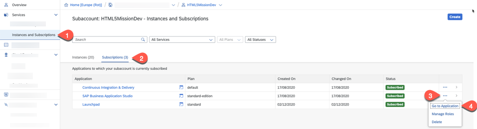
   
3. Log on to the application **Business Application Studio** using your username and password. You have already configured the SAP SuccessFactors Identity Provider as an additional identity provider, so you may have to choose between the two identity providers depending on how you configured in the last section of [Trust setup and assigning relevant Roles](../trust-setup/README.md). Choose one of the Idenity Provider with which you want to develop your application. 

   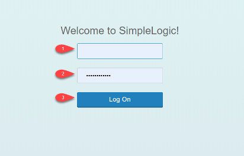
 
4. In SAP Business Application Studio, click the button *Create Dev Space*.

   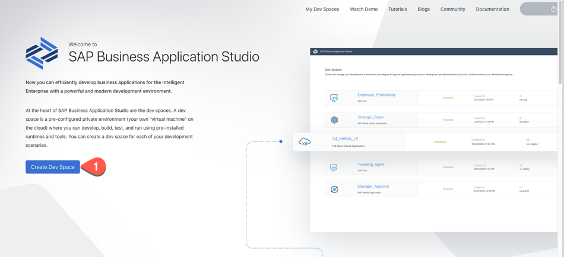
 
5. On the next screen, enter a Dev space name, for example: **BusinessProcess** or **sfmission** and select the type *Full Stack Cloud Application*. Choose *Create Dev Space*

   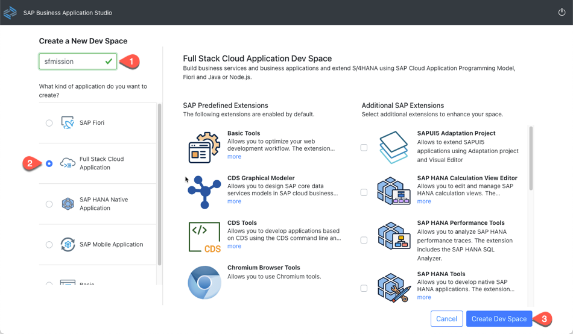  
 
6.	Your Dev Space is now being created. As soon as the Dev Space is available you can click on your dev space name to access it.

   
7. After the dev space opens, click on **Open Folder** to open the **projects** folder before cloning the sample application.

   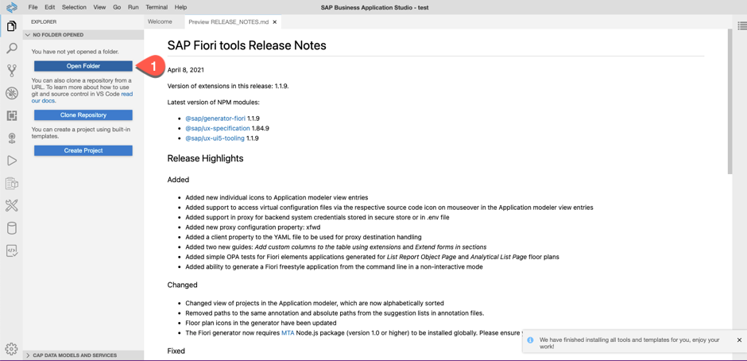
   
8. Choose the folder **projects** and click **Open** to open the **projects** folder.

   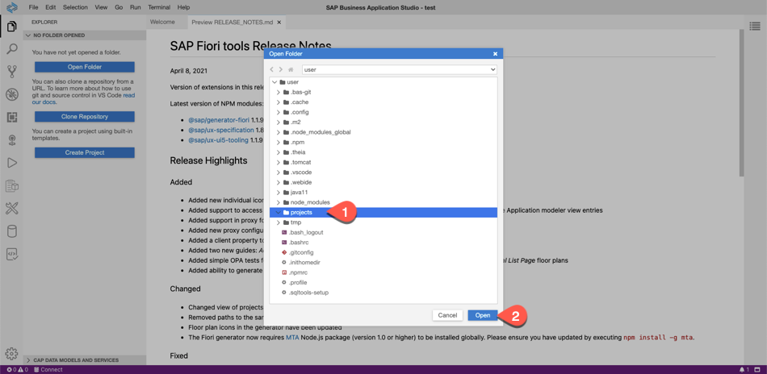
   
9. Choose *Terminal -> New Terminal* in the menu on the top of your screen.

    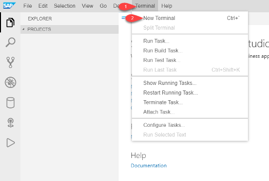
 
10. Enter your Github user name and email.
   
   ```bash 
   git config --global user.email "your@email"

   git config --global user.name "your Name"
   ``` 
 
11. To clone the sample code in your projects folder, give the following command.

   ```bash
   git clone https://github.com/SAP-samples/cloud-sf-extension-cap-sample.git
   ```
   
   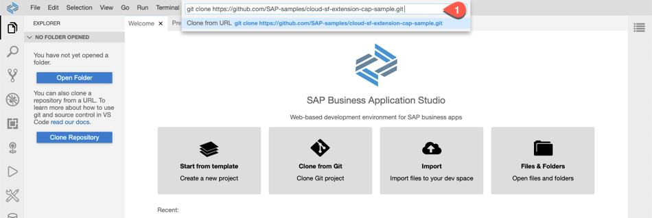  
    
12. Let us now login to your SAP BTP account in *SAP Business Application Studio* in order to deploy your application from *SAP Business Application Studio*.
 
   * Check if you are logged in to your SAP BTP Account from *SAP Business Application Studio*.
     
   * To login to Cloud Foundry, In the tabs, choose **Find Command**.
    
   * Search for **CF Login**.
    
   * Select **CF: Login on to Cloud Foundry**.

     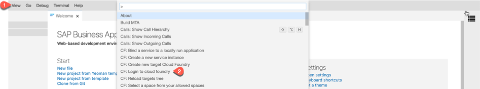 
    
   * Enter CF API endpoint or take the default suggested API endpoint. You can find the API endpoint of your region in the overview page of your SAP BTP subaccount in the cockpit. Copy the API Endpoint. Write down the **Org Name** and copy the **Space Name** into a text editor of your choice because you will need it in the next step. 

     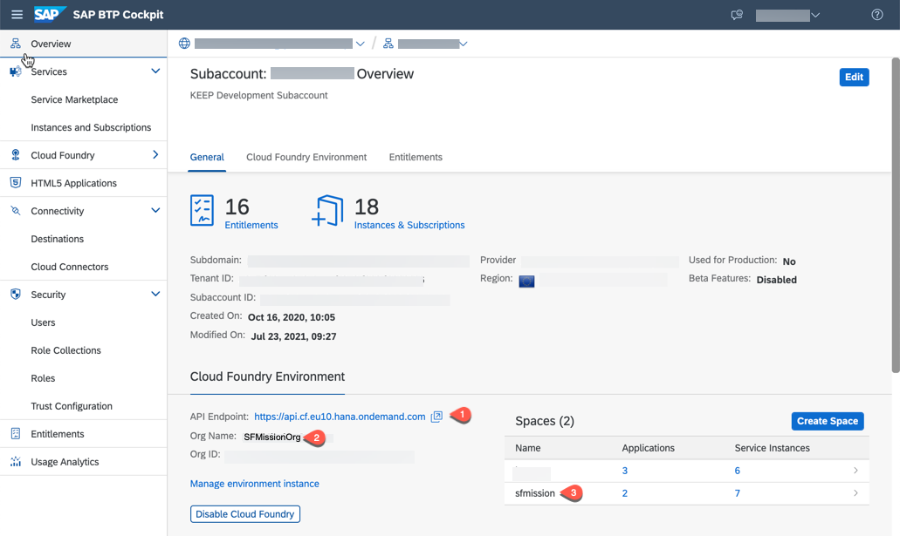
     
   * Enter your **email** and **password** when prompted.
   * Select your Cloud Foundry **Org** which you have already written down.
   * Select the space name which you have written down. Once you have selected the Org and Space, you would login to your Cloud Foundry account from SAP Business Application Studio.

12. In the **Explorer**, choose **Projects**, right-click on the **cloud-sf-extension-cap-sample** project and choose Upload Files.
    
    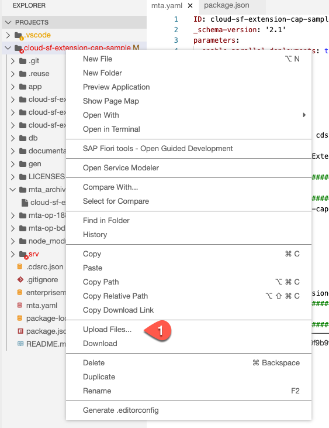 

13. Upload the three SAP SuccessFactors API **.edmx** files which you have downloaded from [SAP API Business Hub](../api-hub/README.md).
14.	Open a new terminal, navigate to the **cloud-sf-extension-cap-sample** folder and import the three **.edmx** files to the project using the **cds import** commands as shown below:
    
    ```bash
    cds import ECSkillsManagement.edmx

    cds import FoundationPlatformPLT.edmx

    cds import PLTUserManagement.edmx
     ```
15. Check the **srv/external** folder of the project - here you find the three files and the generated **.csn** files.

16. Open the **PLTUserManagement.csn** file and search for **reviewFreq** field. After import of edmx file, the field length is '200000000' but SAP HANA Cloud Database allows a maximum length of 5000, so edit the length of 'reviewFreq' field as '5000' and click 'Save' to save the changes.

    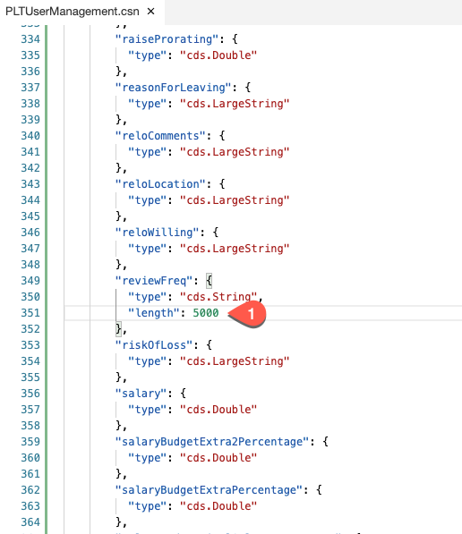 

17. Open mta.yaml file from  **Projects** > **cloud-sf-extension-cap-sample** > **mta.yaml** to open it in the editior.

18. In the section, **SuccessFactors Extensibility Service** replace the value of the **systemName** with your SAP SuccessFactors system that you have registered in the [System and Trust Setup](../trust-setup/README.md). 

   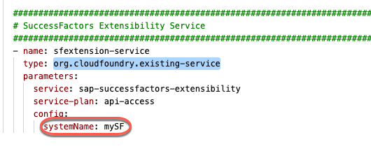

19. Now open the file **enterprisemessage.json**. Modify the values for **emname** and **namespace**. Modify `"emname": "<yourmessageclientname>","namespace": "<yourorgname>/<yourmessageclientname>/<uniqueID>"` with values for `"<yourmessageclientname>"`,`<yourorgname>/<yourmessageclientname>/<uniqueID>"` as described below.  
		
	> The `<yourmessageclientname>` and `<uniqueID>` can be any random unique identifier. `<yourorgname>` can be your Org name without '-' or any special character.  Please make sure that namespace does not exceed 24 characters. For more details regarding the syntax, size and characters allowed in namespace are mentioned [here](https://help.sap.com/viewer/bf82e6b26456494cbdd197057c09979f/Cloud/en-US/5696828fd5724aa5b26412db09163530.html?q=namespace).

   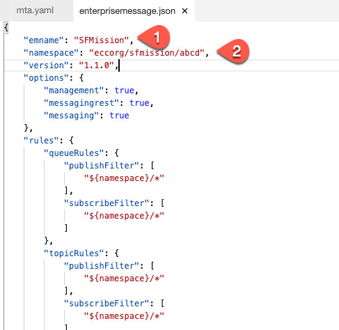    
   
   > Copy the value of **namespace** which you would need for the next step.
   

20. In the Explorer, choose **Projects** > **cloud-sf-extension-cap-sample** > **package.json** file to open it in the editor. In the **cds** section, you find the three imported APIs. Add a **credentials** section to each of them. This section contains the destination to the SuccessFactors account which you will create in a later step. As the SAP SuccessFactors APIs use OData V2, you have to set the correct path.   
    
    ```bash
     "credentials": {
     "destination": "sfextension-service", "path": "/odata/v2",
     "requestTimeout": 18000000
     }
    ``` 

    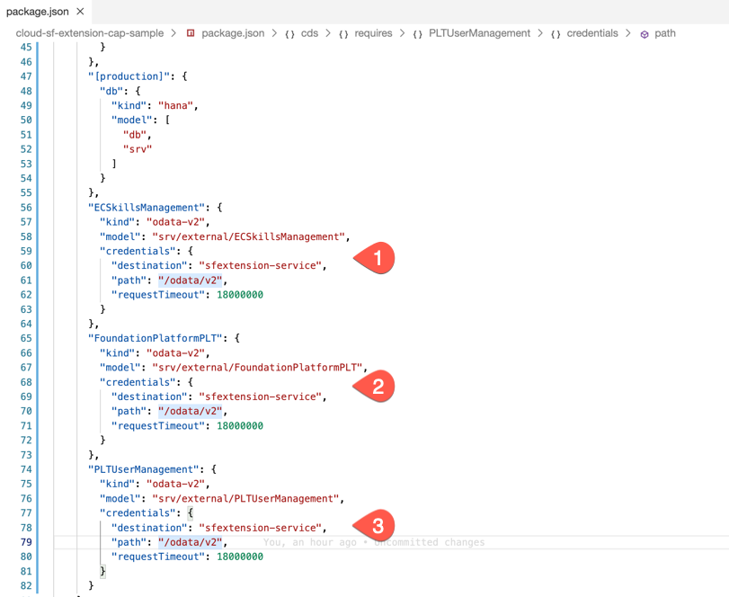 


21. For this tutorial, you need a SAP HANA Cloud database and SAP HANA Cloud does not support HDBCDS. Therefore we have to change the deploy format to HDBTable. Check in the **pacakge.json** file that you have the following setting in the **cds** section:
     
     ```bash
     "hana": {
            "deploy-format": "hdbtable"
        },
     ```

    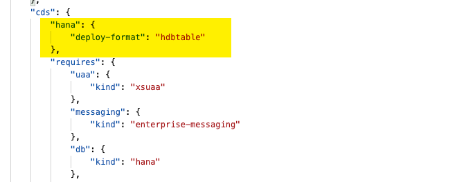   


22. Choose **File** > **Save All** 


### Build and Deploy

1.	Build the MTA Archive. Right-click on the **mta.yaml** file and select **Build MTA Project**.
   
   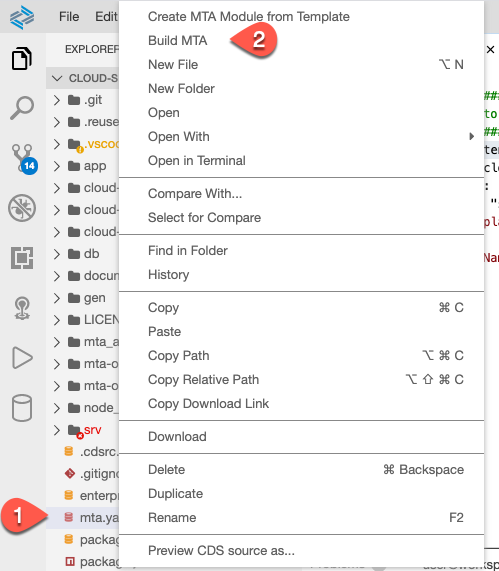

2. If the build is successful, you find the generated **mtar** file the **mta_archives** folder. Right-click on this file and select **Deploy MTA Archive**.

   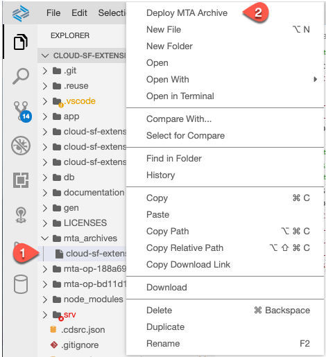 
   
3. Once the deployment is successful, check the new destination **sfextension-service** created in your SAP BTP subaccount. It contains all the necessary parameters to connect to your SAP SuccessFactors account. 

   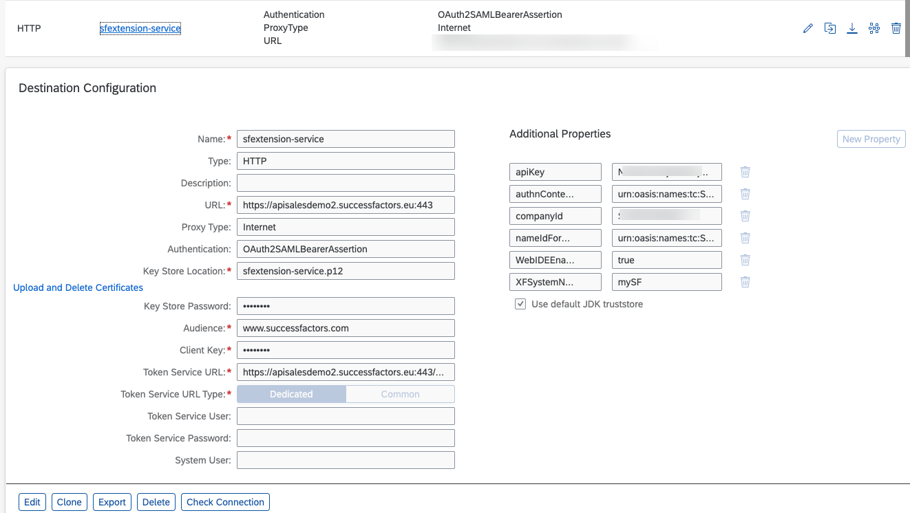 

4. After deploying the MTA archive, you can check in your SAP BTP sub-account if the following applications are deployed and running:
   
   * There are 2 applications deployed in your space:	cloud-sf-extension-cap-sample-srv and cloud-sf-extension-cap-sample-db

     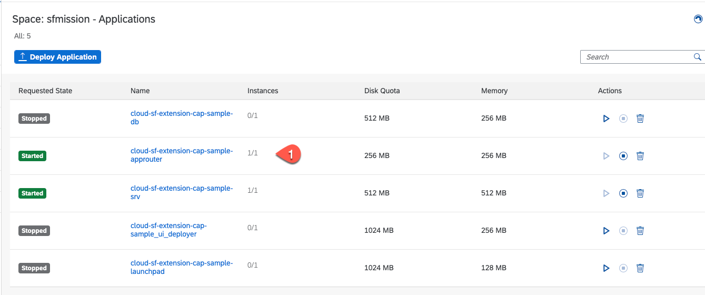
   
   * In your sub-account level, click **HTML5 Applications** and check the running 2 HTML5 Applications.

     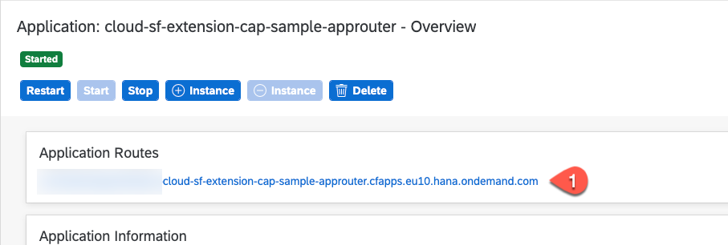
     
   * You can click and test both the HTML5 applications.
   * Click on the **projects** HTML5 application and choose **Projects** tile, Log in using your SAP SuccessFactors identity provider with your SuccessFactors user.

     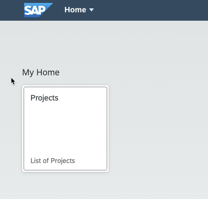 
     
     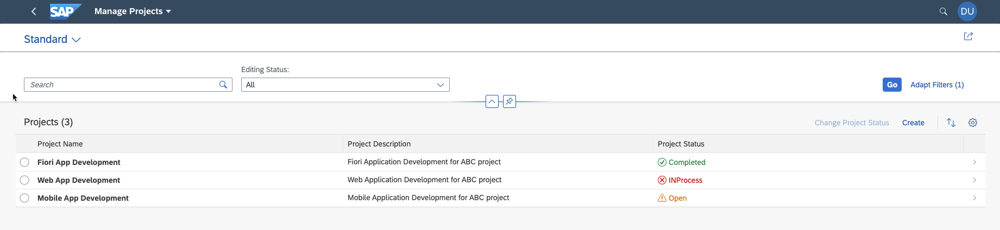 
     
   * Select **notifications** application and choose **Notifications** tile.

     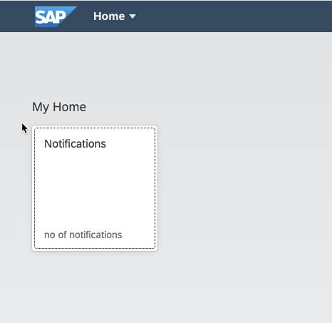 
     
     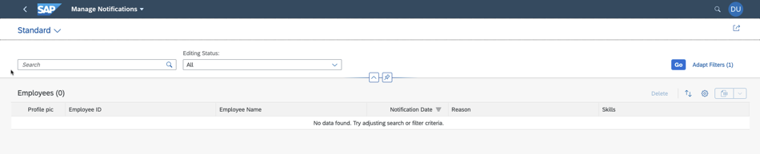 
   
   * If you want to add both the applications in a single **Launchpad** site, follow the instructions in [Publishing your application to SAP Launchpad Site](../launchpad/README.md), then you can see both the applications in a single site like below screenshot.
     
     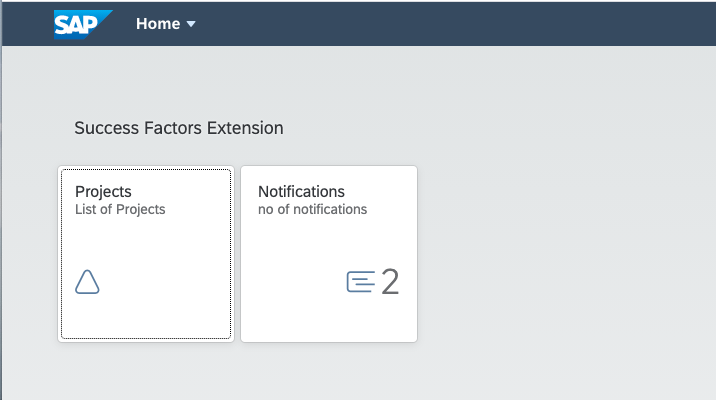 
 
**Result**: You have finished the application configuration, for running a full test of the application, you have to first have to setup the eventing service and enable eventing in your SAP SuccessFactors account, which will be part of the next chapters.
