# Publishing your application to SAP Build Work Zone, standard Edition Site

## Introduction

In this section, we would describe steps of how you can add your HTML5 application to the SAP Build Work Zone, standard Edition and how you can build a company site with the HTML5 application. 
You can later add this company site into your SAP SuccessFactors Employee Central homepage.

**Persona:** SAP Build Work Zone, standard Edition Administrator

**Abbreviation:** SAP Business Technology Platform = SAP BTP

## Step-by-Step
 
### Open SAP Build Work Zone, standard Edition

1. Login to your SAP BTP account.
2. Check if your user has access to open the SAP Build Work Zone, standard Edition application, check and assign the role collection **Launchpad_admin** to your user following [Assign Role for SAP Launchpad](https://help.sap.com/viewer/8c8e1958338140699bd4811b37b82ece/Cloud/en-US/fd79b232967545569d1ae4d8f691016b.html). Your user would have automatically got the necessary roles if you have [created a BTP account using the boosters](../scp-setup/README.md).
3. Select **Services** and choose **Instances and Subscriptions**. 
4. Select the tab **Subscriptions**, look for **SAP Build Work Zone, standard Edition**, Select the three dots **...** to open the relevant **Actions**. Select **Go to Application** to open the **SAP SAP Build Work Zone, standard Edition** service. 

   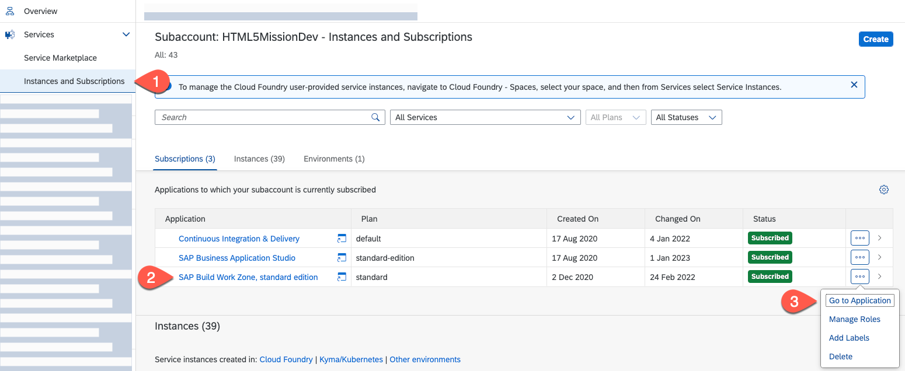
   
5. Enter your SAP BTP email and password or your custom Identity Provider credentials to login to the SAP Build Work Zone, standard Edition Application which opens in a separate browser tab.

### Add HTML5 applications to necessary Group and Role
  
1. Select on **Provider Manager** to check the Content Providers and to refresh the list of HTML5 Applications. 

   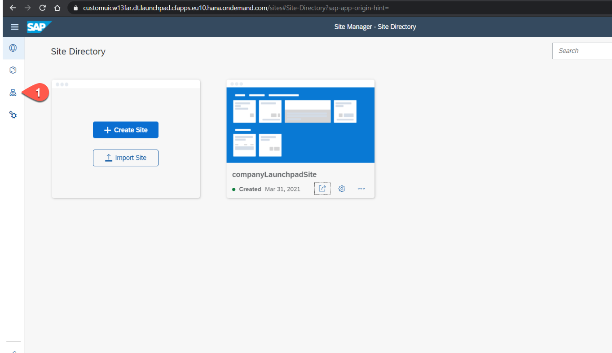
   
2.  Select **Fetch Updated Content** to manually fetch any new HTML5 applications deployed to the SAP BTP. This will fetch any new content deployed. Then Select **Content Manager** to look and add the HTML5 apps to SAP Build Work Zone, standard Edition site.

   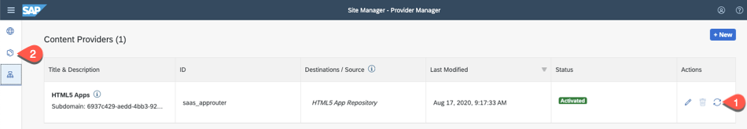
   
3. In **Content Manager**, Select  **Content Explorer** tab and Select **HTML5 Apps** to see the list of HTML5 applications to be added to the SAP Build Work Zone, standard Edition site.

    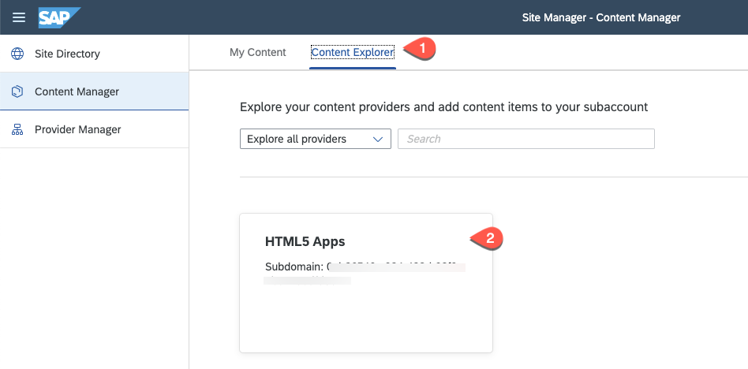
    
4. Select both your HTML5 applications: **Manage Notification** and **Manage Projects** from the list and Select **Add to Content**. 

   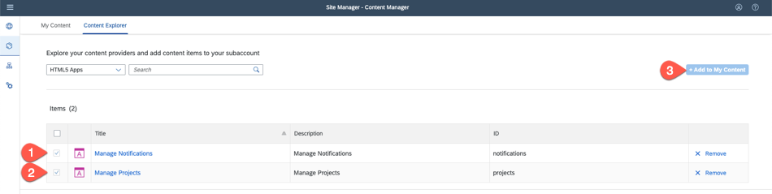

5. Select **My Content** and choose **New** and Select **New Role** to create a role for these 2 applications.

   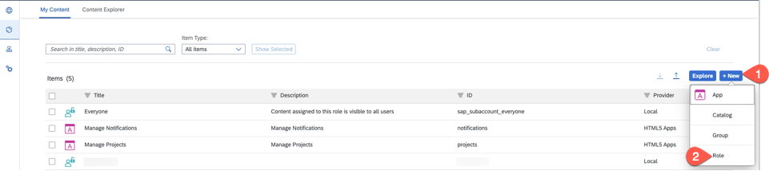
   
6. Enter a meaningful **Title** and **Description** and in the **Assignments** section, Select the **Search** icon which displays both the HTML5 applications, Select the **+** icon next to **Manage Notification** and **Manage Projects** app and Select **Save** to save the new role which has now access to the two HTML5 applications.

   
   
7. Select role **Everyone** and choose **Edit** and like you did in step 6, Select the **+** icon next to **Manage Notification** and **Manage Projects** app and Select **Save** to save the changes. 
8. Select **back** icon to go back to the previous screen and Select **New** and Select **Group** to create a new group.

   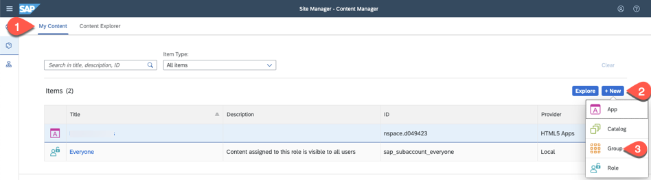
   
9. Enter a group name, for example: **SFSFGroup** and a valid description. In the **Assignments** section, Select the **Search** icon which displays both the HTML5 applications, Select the **+** icon next to **Manage Notification** and **Manage Projects** app and Select **Save** to save the new group.

   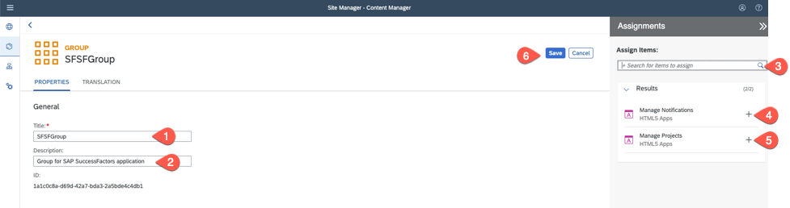
   

   
### Create a SAP Build Work Zone, standard Edition Site

1. Select **Site Directory** to create a new SAP Build Work Zone, standard Edition site for your company.

   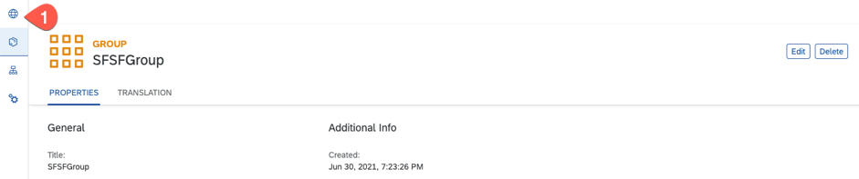
   
2. Select  **Create Site** to create a company SAP Build Work Zone, standard Edition site.
   
   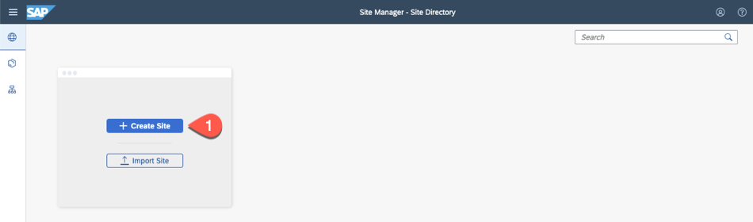

3. Enter a site name, for example : **companyLaunchpadSite** and Select **Create**.

   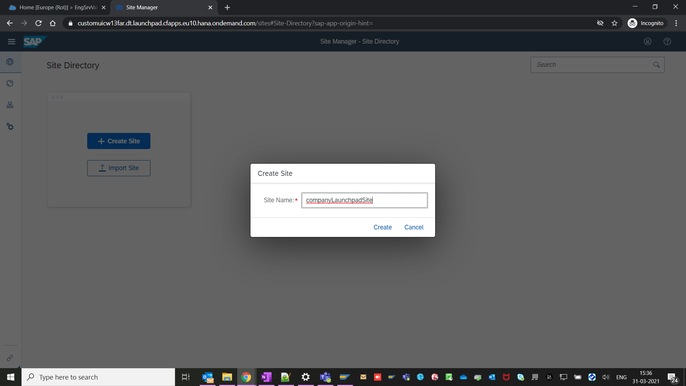
   
4. Select **Edit** and in the **Assignments** section, Select the search icon and select the created role **SFSFAppRole** and choose **Save**.
 
   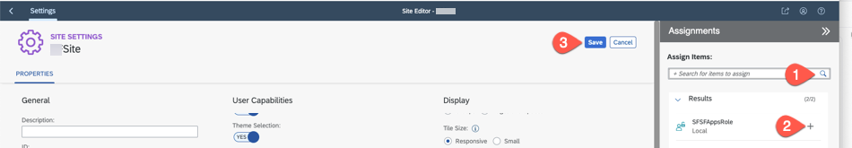
   
 5. You can see the company SAP Build Work Zone, standard Edition site URL in the URL field. Copy the URL of the SAP Build Work Zone, standard Edition site which you can add later in SAP SuccessFactors Employee Central in the Home page.
  
   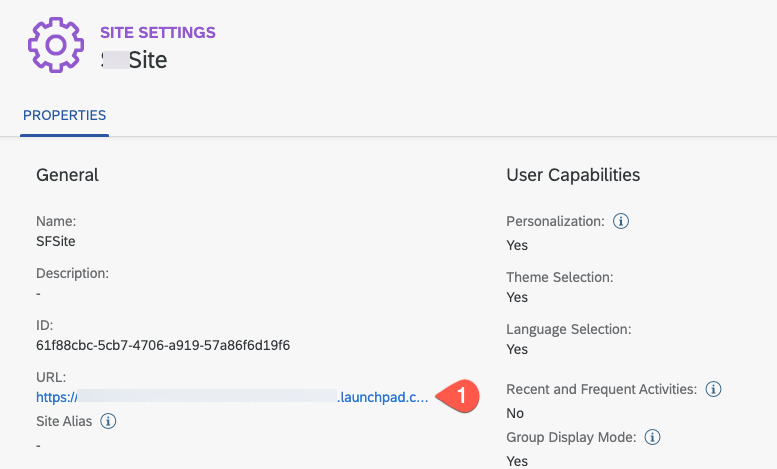

### Assign Role to Users

1. Switch to your SAP BTP account cockpit.
2. Select **Role Collections** and select the role which you created in the previous step, for example: **SFSFAppsRole**.

   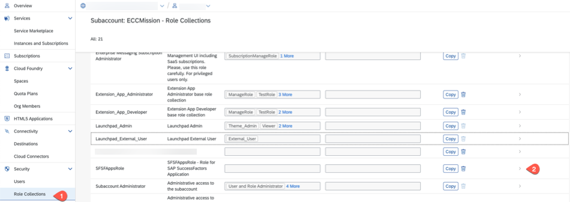
   
3. Select **Edit** and in the **Users** section, Select **+** and enter the **ID**, choose the **Identity Provider** and enter **E-mail** for all the users who would access the SAP Build Work Zone, standard Edition site. You might want to add all your SAP SuccessFactors users with the custom Identity Provider or assign the relevant group. 

    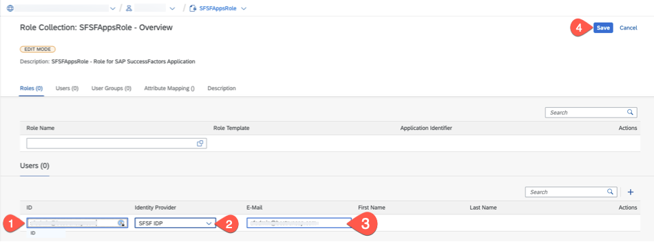
    
 4. You can now access the SAP Build Work Zone, standard Edition site URL which you copied in the previous step. If you do not have authorizations, try to logout and login with the user or open in a private browser window. You will see both the **Notifications** and **Project** HTML5 applications.

    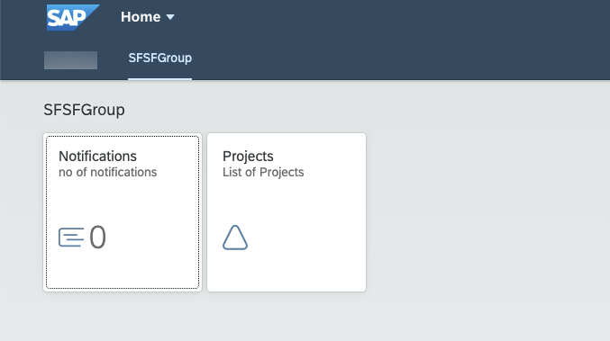    
    

### Result

You have successfully created a SAP Build Work Zone, standard Edition site, giving necessary roles and groups and added your HTML5 application to the SAP Build Work Zone, standard Edition site.
