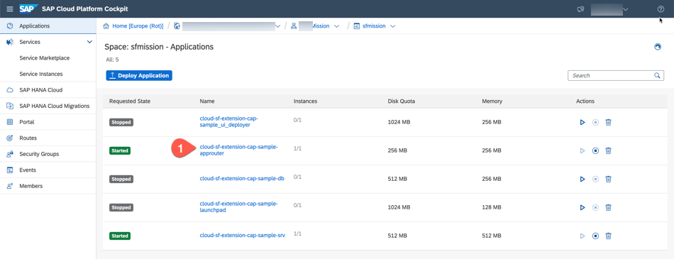
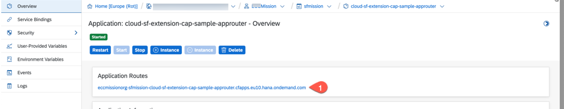

# Setup of a SAP Cloud Platform Account using Boosters

## Introduction
Let us now try to test the end to end scenario by triggering an 'Employee Termination' event in the SuccessFactors system and then we can view and consume this event in our SAP Cloud Platform extension Application.

###Step-by-step

1. Login to your SAP Cloud Platform account.
2. Navigate to your sub-account and space where you have deployed your SuccessFactors extension application.
3. Click 'Applications' and select the App Routter application, example: `cloud-sf-extension-cap-sample-approuter`.

   
   
   > If project is deployed without portal service then form the url to run your application like below
   >
   >`https://<tenantId>.<appRouterHost>.<domain>/<appName-appVersion>/<resourcePath>`
   >
   >Example:
    ```  https://<approuter-url>/projects-1.0.0/index.html ```
    
4. Click the URL of the app `cloud-sf-extension-cap-sample-approuter` - this is the launch URL for our extension application.
   
   
  
5. Launch the URL and login with your SuccessFactors user name who is a manager. Example : In our demo instance, we logged with user  dleal(David Leal) who is a manager.

   > You can choose any employee who is a Manager.

6. Click on 'Projects' tile.

   
   
7. Click on a Project from the list. 
8. Click on Edit button

   

9. Click on Create Button.
   
   

10. Click the Drop-Down

   
   
11.  All employees reporting to David Leal is displayed.
12. Select a employee and assign them to projects. E.g Simon Rampal(srampal) and click 'Save' to save the changes.
13. Login to SF demo instance with SuccessFactors Admin user, in our case the admin user is 'sfadmin'.

    
    
14. Search for Employee 'David Leal' (dleal) in the Employee Directory.
15. Select Employee 'David Leal'.
16. Click 'Actions' and Select 'Jump to Org Chart'.
    
    
17. Choose an employee who is reporting to 'David Leal' e.g Simon Rampal(srampal) who was assigned to the project in step 12.

18. Click on 'Take Action' button and Select 'Termination'.
    
    
    
19. Set values for
      - Termination Date (Recommended to use a future date. For example, a date one week from the current date)
      - Termination Reason - Early Retirement
      - Ok to Retire - Yes
      - Regret Termination - Yes
      
        
        
20. Click 'Save'.
21. In the window `Please confirm your request`, click on the 'Show workflow participants'.
22. For the Termination Event to get triggered, tow more Workflow participants has to approve this termination. In our demo system, workflow participants are shown as 1. Paul Atkins (Production Director); 2. Tessa Walker (HR Business Partner Global), Christine Dolan (Chief Human Resources Officer)
> This means that Paul Atkins and Tessa Walker (or Christine Dolan) must approve this request to proceed.
23. Click 'Confirm' button.
24. You can login/ask the workflow participants to approve the request. We can use the 'Proxy Now' functionality and Select Target User as 'Paul Atkins(patkins)' to approve the request.
    
    
    
25. In the Home page of 'Paul Atkins' click on tile 'Approve Requests'.
26. Click 'Approve' button for the request for approval of Early Retirement of 'Simon Rampal'.
    
    
    
27. Again use 'Proxy Now' functionality and Select Target User as 'Tessa Walker(twalker)'.
28. In the Home page of 'Tessa Walker', click on tile 'Approve Requests'.
29. Click 'Approve' button for the request for approval of Early Retirement of 'Simon Rampal'. Now 2 users have approved the early retirement and an event would be triggered.
30. Switch to the browser window where you have opened the SAP Cloud Platform extension application (you opened this app in Step 3).
31. Login with user 'David Leal (dleal)' who is a manager.
32. Click the tile 'Notifications'.
    
    
    
33. Notification will be displayed regarding Resignation of Simpon Rampal along with his Skillset.

    
