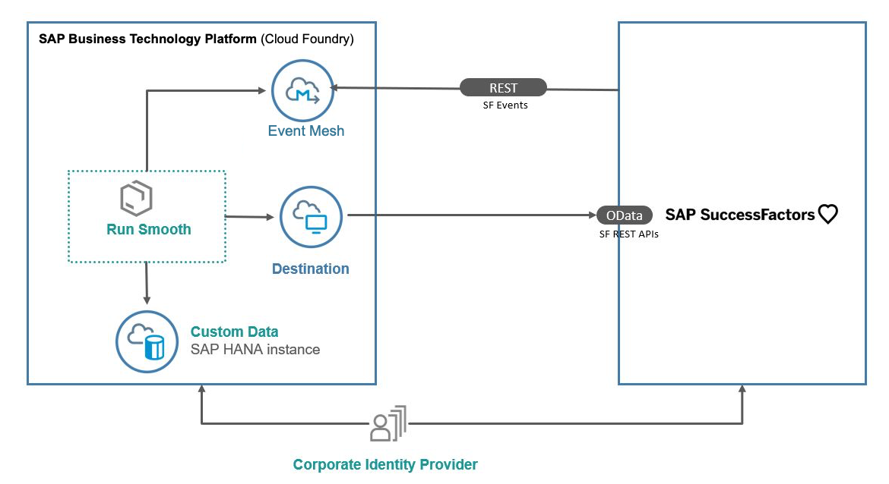

# Mission: Business Events with SAP SuccessFactors and SAP Enterprise Messaging

[Link to Mission]()

## Description

This application showcases:

* Capabilities of SAP Cloud Platform Extension Factory
* Building application on SAP Cloud Platform using SAP Cloud Application Programming Model(CAP)
* Building and Event driven extension application using SAP CP Enterprise Messaging
* Consuming REST API's from SAP SuccessFactors using SAP CP Destination Service

## The Business Scenario

In this reference application called as Run Smooth a business scenario is used to showcase the technology components. A Manager maintains in the Run Smooth application the staffing details of all the projects to which the employees reporting to him are contributing to. He can create project and assign employees to the projects. An employee contributing to a project might decide to leave the team/ company. When this happens, the manager gets a notification with the projects that the employee is working on and the skillsets of the employee. This information can be used by manager to find/hire a replacement for employee and assign the projects.

Features:
* Create Projects
* Assign Employees
* View the list of projects, employees working on the projects.
* Get notification when an employee is leaving the team with the consolidated report on the skills of the employee.

## Architecture

## Requirements

| Service                           | Plan       | Number of Instances |
|-----------------------------------|------------|:-------------------:|
| Destination                       | lite       |          1          |
| Enterprise Messaging              | default    |          1          |
| SAP HANA Schemas & HDI Containers | hdi-shared |          1          |
| SAP SuccessFactors Extensibility  | api-access |          1          |
| SAP Hana Cloud                  | hana |          1          |
| Application Runtime              | memory         |          3          |
| Continuous Integration & Delivery	    |  default	 |	    1	       |
|Launchpad     |  Standard	 |	    1       |

## Step-by-Steps Guides

* [Get the Successfactor APIs](../api-hub/README.md) 
* [Setup your SAP Cloud Platform Account using Boosters](../scp-setup/README.md) 
* [Setup Trust between your SAP Cloud Platform and your SAP SuccessFactors account](../trust-setup/README.md)
* [Configure, deploy and build the CAP Extension Application](../extension-app/README.md)
* [Integrate SAP Continuous Integration & Delivery (optional)](../cicd/README.md) 
* [Confgure the SAP Enterprise Messaging Service](../ems-config/README.md) 
* [Configure Messaging in SAP SuccessFactors](../sf-configuration/README.md)
* [Run the Demo Application](../run-demo/README.md)