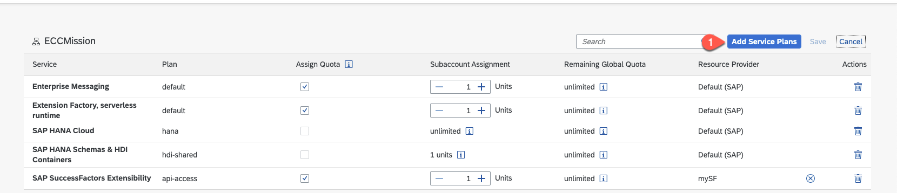
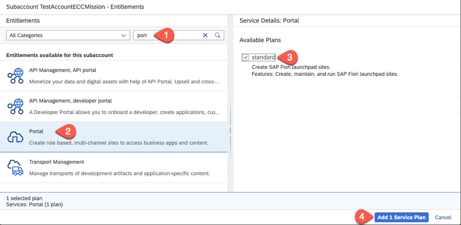
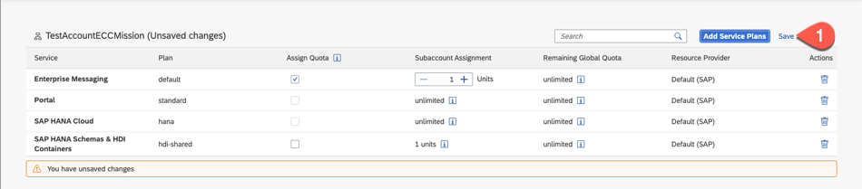
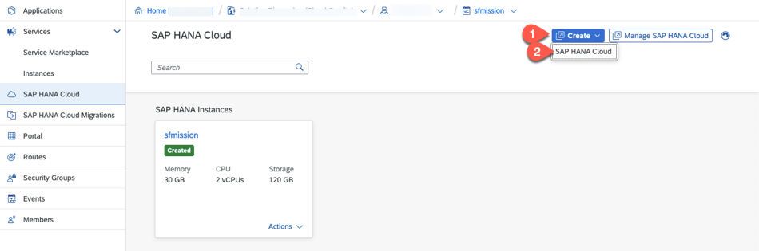
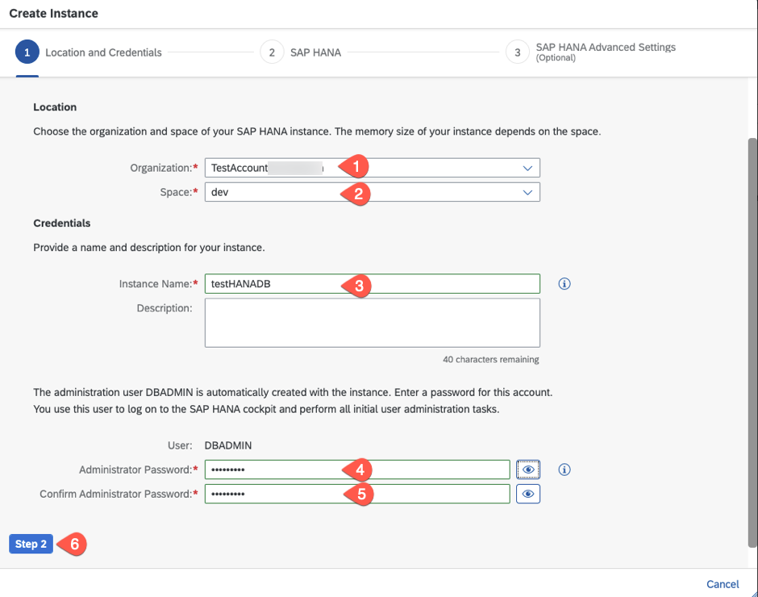

# Set up a SAP Business Technology Platform Account using Booster

## Introduction

For running this SAP SuccessFactors extension tutorial, you will need the following services in your SAP Business Technology Platform (SAP BTP) account.

* SAP Business Application Studio
* Event Mesh
* Enterprise Messaging Hub
* Cloud Foundry Runtime
* SAP HANA Cloud service
* SAP Portal / SAP Launchpad
* SAP Continuous Integration & Delivery service (optional)

The entitlement differs for the pricing option of your account:

* **Consumption-based SAP BTP Account:** 
No entitlement necessary. Be sure that you have enough credits to run the services.

* **Subscription-based SAP BTP Account:** 
You have to create entitlements for the services above - [See Entitlements and Quotas](https://help.sap.com/viewer/df50977d8bfa4c9a8a063ddb37113c43/Cloud/en-US/38ecf59cdda64150a102cfaa62d5faab.html#loio363f0f68f9704830ac65c87a2562559b).

To check how much these services would cost, use the [SAP BTP Estimator Tool](https://www.sap.com/products/cloud-platform/pricing/estimator-tool.html?blueprintId=a0ad3bc5-4fcb-4008-b109-bd8f70634d6c)

You can either set up each service individually or use a dedicated booster that will automate the setup for you. To simplify the setup process, SAP has introduced Boosters. Boosters are a collection of wizards that provides functionalities for specific scenarios to automate and speed up the installation and configuration process of a SAP BTP sub-account. This also includes the user management with the mapping of the respective Administrator and Developer roles.

Before running the booster, please check for which regions and infrastructures the services are available. The booster is not able to check this in advance, so it will fail when you select a region where a service is not available.[See SAP Discovery Center Service Catalog](https://help.sap.com/doc/aa1ccd10da6c4337aa737df2ead1855b/Cloud/en-US/3b642f68227b4b1398d2ce1a5351389a.html).

**Persona:** Cloud Administrator (SAP BTP) 

**Abbreviation:** SAP Business Technology Platform = SAP BTP

## Step-by-step

### Prepare a SAP BTP sub-account using Boosters for developing extension applications
 
1. Open your global SAP BTP account cockpit.
   - Select **Boosters** in the menu.
   - Select the Booster **Prepare an Account for Developing Extension Applications**
   
   

2. Read the **Overview** of the **Prepare an Account for Developing Extension Application** booster.

   
 
3. Choose **Components** to get an overview of the services and components that the booster will set up for you. Press **Start** to start the booster.

   

4. The booster checks whether the prerequisites for completing the booster are met. You will be able to continue only if all the prerequisites are met. Otherwise, you will get an error.

   

5. Now let us setup your BTP Subaccount, To learn more about global and subaccounts, refer to this [Account Model help page](https://help.sap.com/viewer/65de2977205c403bbc107264b8eccf4b/Cloud/en-US/8ed4a705efa0431b910056c0acdbf377.html)
   
You find the list of the Services that will acctivated by the Booster. For this tutorial, the **Continuous Integration & Delivery** service is optional same for the **Launchpad** service, if you don't want to use this service, you can remove this service before running the booster. The **Extension Center**, and **Extension Factory, serverless runtime** services are not needed for this tutorial - select the **Remove** icon to remove them. This means they will not be set up when the Booster is completed. 
   
   

If you use a subscription based SAP BTP accounts you have to add 3 quota for Cloud Foundry Runtimes.

   

   - For the field **Subaccount Name**, enter a meaningful subaccount name, for example a name which denotes your project name.
   - Select your **Provider**
   - Select the **Region**
   - You can leave the default unique value suggested for **Subdomain**
   - Enter a meaningful name for the field **Org Name**, for example : SFSFTutorial
   - Enter a space name, for example, 'dev' or 'test' or 'prod'.
   - Press **Next**
  
   

6. In the **Add Users** dialog,
   - Enter the User ID (mail address) of all users with Cloud Administrator role.
   - Enter the User ID (mail address) of all users with Cloud Application Developer role.
   - Choose **Next**
   
     

7. Review your settings and press **Finish** to complete the Booster.
   
   

8.  Check the **Progress** window, tasks should become green.
   
    

9. If the Booster is completed successfully, navigate to your new subaccount.

    

10. Check the roles of your subaccount, Select **Security**, **Role Collections** and you will find the **Extension_App_Administrator** and the **Extension_App_Developer** role collections. If you want to add additional users to work on this tutorial/subaccount, you have to assign one of those role collections.

    

11. Go back to the Overview of your BTP subaccount.

12. Click **Services** and then choose **Instances and Subscriptions**. Select the tab **Subscriptions**, You should see that the following services have been subscribed:

    * SAP Business Application Studio
    * SAP Event Mesh
    * Continuous Integration & Delivery (only when selected in the booster)
    

    

### Configure Entitlements to SAP Portal and SAP Hana service

Currently, this extension application uses local Fiori Launchpad which comes as part of SAP Cloud Portal service, so the application will create a binding to the portal service instance. You have to configure Entitlements for SAP Cloud Portal service.

1. In your SAP BTP Cockpit, choose **Entitlements** and click **Configure Entitlements**.

   
   
2. Choose **Add Service Plans**.

   
   
3. Search for **Portal** and select **Portal** from the list and select the **standard** checkbox from the Available Plans. Choose **Add 1 Service Plan**.

   
   
4. Choose **Save** to save the changes.

   
   
5. Check if you have entitlement to SAP HANA Cloud, if not configure the entitlements in the same way for **SAP HANA Cloud** service with **hana** service plan. 

### B: Create a SAP HANA Cloud Instance
For this tutorial, a SAP HANA Cloud Instance is necessary. Use the following steps for activating it:

1. Go to your subaccount and choose **Services** - **Service Marketplace** and then **SAP HANA Cloud** service tile.
   

2. Choose on **Create Instance** 
   
   

3. In the **New Instance** screen, choose 
   - In the Service field, select **SAP HANA Cloud**.
   - In the Service Plan field, select **hana**.
   - In the Runtime Environment field, select **Cloud Foundry**.
   - In the Space field, select the space you have created when running the **Prepare an Account for Developing Extension Applications Booster**.
   - A message **To manage SAP HANA Cloud instances, click here** with a link appears,click on the link **here** to finish the procedure. You are redirected to another page.

   

4. Choose **Create Database** in the opened popup.

   

5. Enter an instance name, a description and a password. If everything is correct, the Step 2 button appears. Choose Step 2.

   

6. Set up the size of your in-memory data in your SAP HANA database. For example, 30 GB. Choose **Step 3**.

   

7. Keep the advanced settings as they are and choose **Create Instance**

   

8. When the SAP HANA instance is created, you should see a similar result:

    
    

