# Setup of a SAP Cloud Platform Account using Boosters

## Introduction

For running the SuccessFactors extension mission you will need the following services in your SAP Cloud Platform account.

* SAP Business Application Studio
* SAP Enterprise Messaging
* SAP Enterprise Messaging Hub
* SAP Application Runtime
* SAP HANA Cloud Service
* SAP Portal / SAP Launchpad
* SAP Continuous Integration & Delivery Service (optional)

The entitlement differs for the pricing option of your account:

**Consumption-based SAP Cloud Platform Account:** 
No entitlement necessary. Be sure that you have enough credits to run the services.

**Subscription-based SAP Cloud Platform Account:** 
You have to create entitlements for the services above - [see also Entitlements and Quotas](https://help.sap.com/viewer/df50977d8bfa4c9a8a063ddb37113c43/Cloud/en-US/38ecf59cdda64150a102cfaa62d5faab.html#loio363f0f68f9704830ac65c87a2562559b).

[Check the costs with the SAP Cloud Platform Estimator Tool](https://www.sap.com/products/cloud-platform/pricing/estimator-tool.html?blueprintId=a0ad3bc5-4fcb-4008-b109-bd8f70634d6c)

**Booster:**

The setup could be done for each service individually. To simplify the setup process, SAP has introduced Boosters. Boosters are a collection of wizards that provides functionalities for specific scenarios to automate and speed-up the installation and configuration process of a SAP Cloud Platform sub-account. This also includes the user management with the mapping of the respective administrator and developer roles.

Before running the booster please check for which regions and infrastructures the services are available - [see SAP Cloud Platform Regions and Service Portfolio ](https://help.sap.com/doc/aa1ccd10da6c4337aa737df2ead1855b/Cloud/en-US/3b642f68227b4b1398d2ce1a5351389a.html) - unfortunately the booster is not able to check this in advance, so it will fail when you select a region where a service is not available.

**Persona:** SAP Cloud Platform Administrator

## Step-by-step

### A: Run the Booster

1. Start the Booster
   Login to your global SAP Cloud Platform account.
   1. Select Boosters in the SAP Cloud Account menu.
   2. Select Extension Suite
   3. Select the Booster "Prepare an account for Developing Extension Applications"
   
   

2. Booster Overview

   
 
4. Select Components to get an overview of them. Press Start

   

5. Check Prerequisites. If Ok press Next - otherwise check the error message.
   

6. Setup Subaccount
   
   You find the list of the Services that will acctivated by the Booster. For this mission the Countinuous Integration & Delivery service is optional, if you don't want to use it you can remove it. The Extension Center and Extension Factory service are not needed for the mission - click on the basket to remove them.
   
   

   1. In the sub section enter a meaningful Subaccount Name - in general it reflects the organisation of your team etc.
   2. Select your Provider
   3. Select the Region
   4. Enter a meaningful Org Name
   5. Enter a space name - this should reflect the name of your project
   6. Press Next   
  
   

7. Add User
   1. Enter the User ID (mail address) of all administration users
   2. Enter the User ID (mail address) of all development users
   3. Press Next
   
   

8. Review your settings and press Finish
   
   

9.  Check the Progess - all sections should get green
   
    

10. If you succeed navigate to the new Subaccount.

    

11. Check your subaccount: 
    Select Security - Role Collection
    You will find the Extension_App_Administrator and the Extension_App_Developer role collection. If you want to add additional users to the mission you have to assign one of those role collections.

    

    Click on Subscriptions - check if the following subscriptions are enabled:
    * SAP Business Application Studio
    * Enterprise Messaging
    * Continuous Integration & Delivery (only when selected in the booster)   
    
    

### B: Create a SAP HANA Cloud Instance
For this mission a SAP HANA Cloud Instance is necessary. Use the following steps for activating it:

1.  Select Services - Service Marketplace - SAP HANA Cloud
    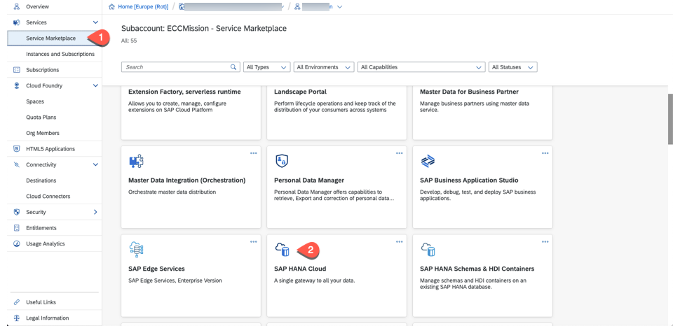

2.  Click on Create Instance 
   
    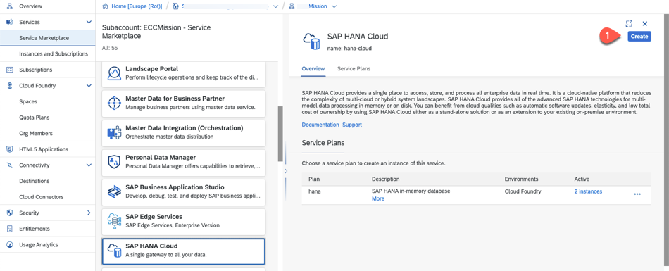

3.  In the "New Instance" screen select 
    * Service = SAP HANA Cloud
    * Service Plan = Hana
    * Runtime Environment = Cloud Foundry
    * Space = the space you have created with the Booster
   
    click on **here**
   

    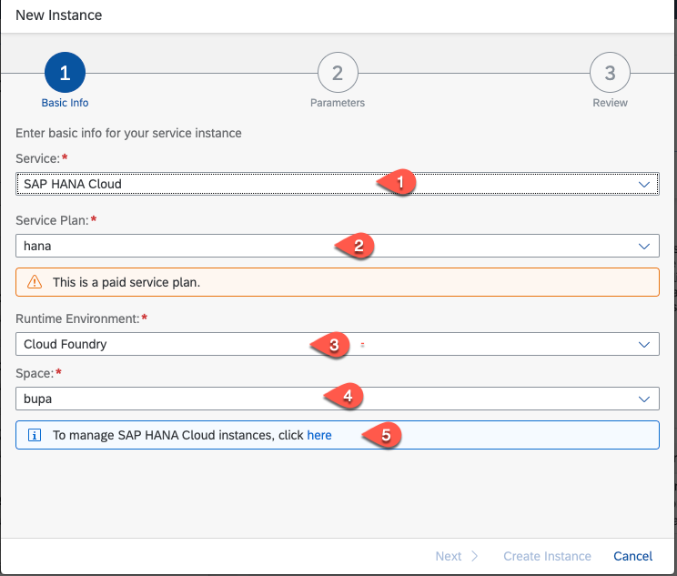

4.  Click on Create Instance

    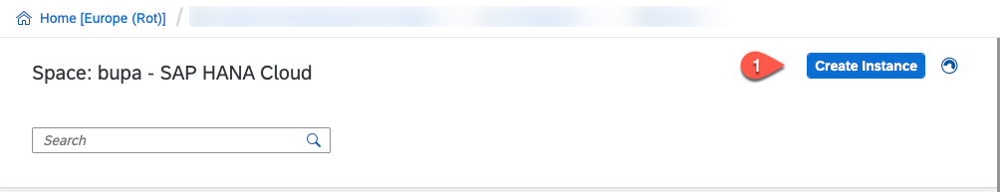

5.  Enter an instance name - description and password. if everything is correct the "Step 2" button appear - click on it.

    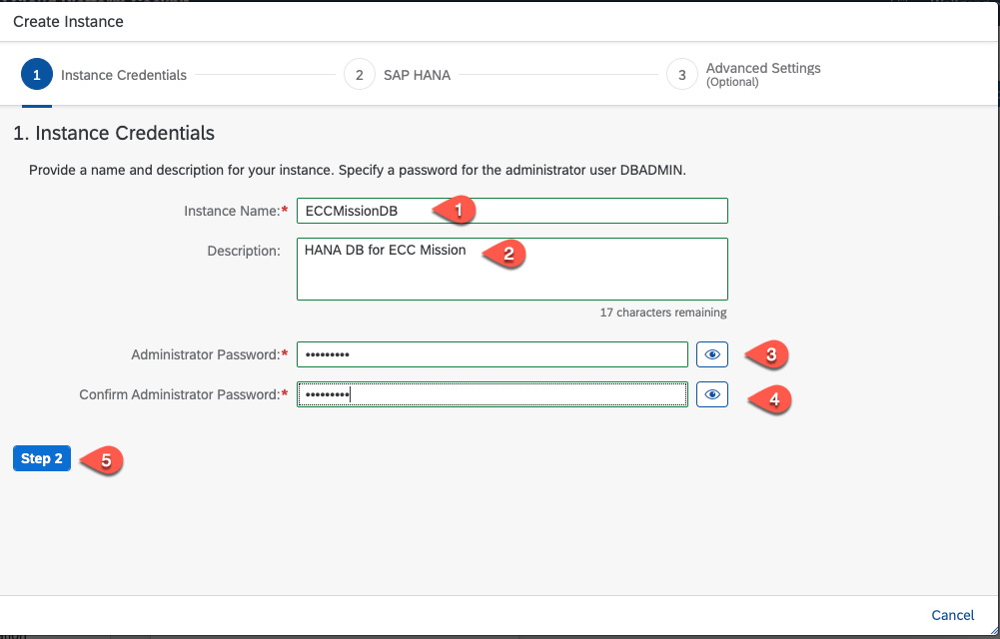

6.  Here you can setup the size of the SAP HANA Cloud instance - for the mission you can keep the minimum settings - click on "Step 3"

    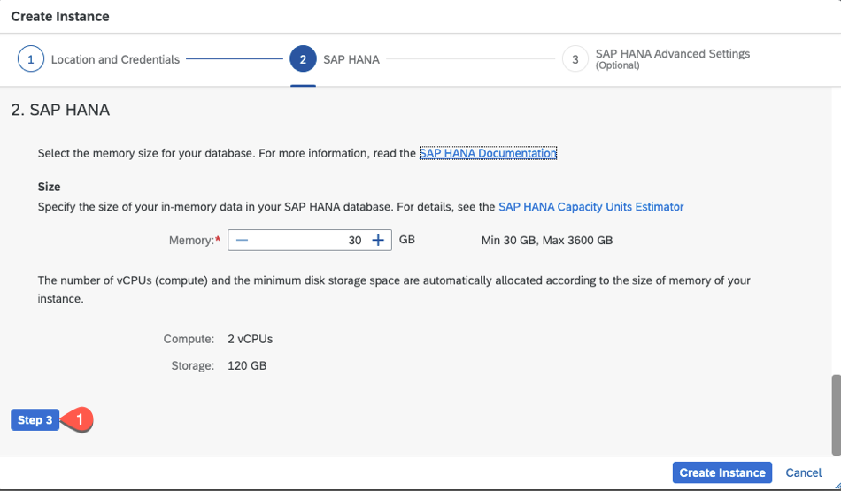

7.  Keep the Advanced Settings and click on "Create Instance"

    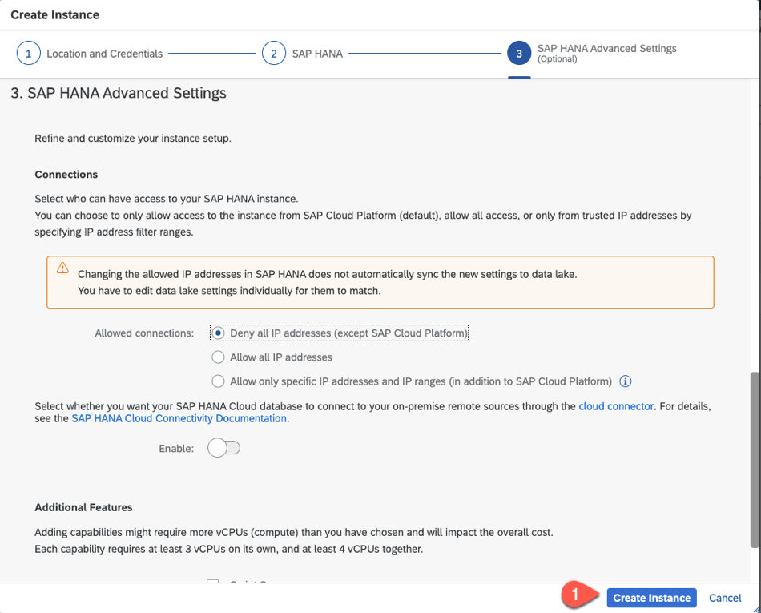

8.  After some minutes the HANA instace is created and you should see a similar card.

    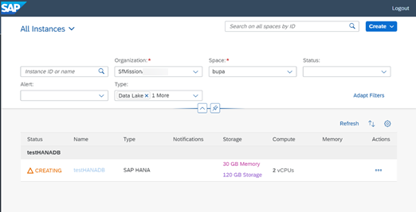
    

### Subscribe to SAP Launchpad and assign relevant roles

As this booster does not automatically yet subscribe to the SAP Launchpad, we have to manually subscribe to SAP Launchpad and assign the relevant roles as well. 

1. Login to your global SAP Cloud Platform account and navigate to your sub-account.
2. Select Subscription and search for Launchpad. Click on the tile to open the Overview page
   
   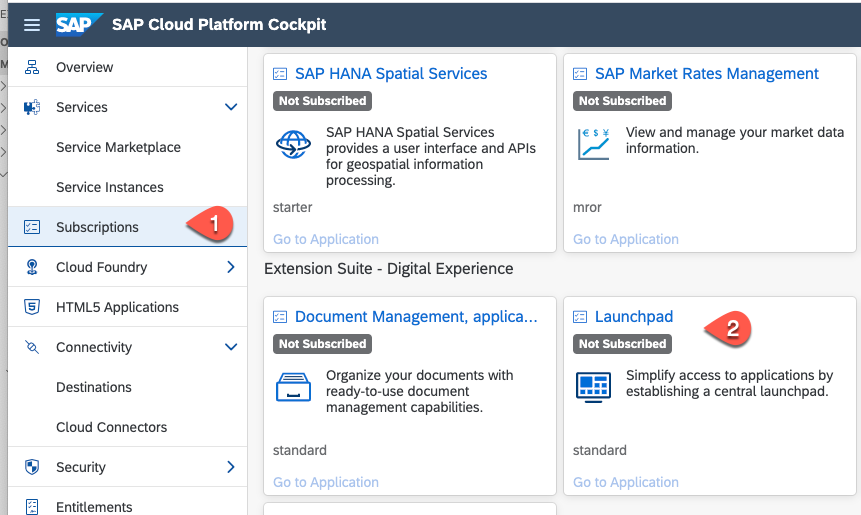 

3. Click on Subsribe. If subscription is done go back to the subaccount overview.
   
   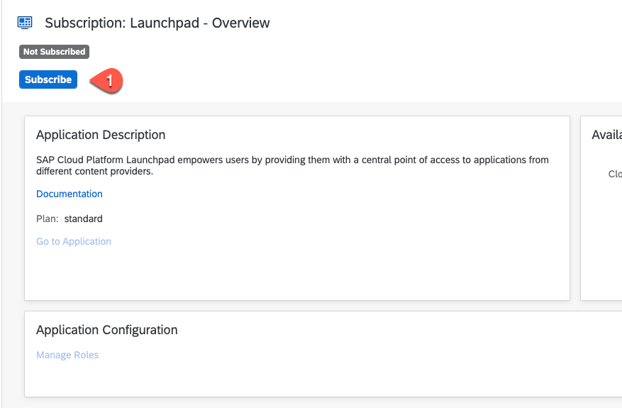 
   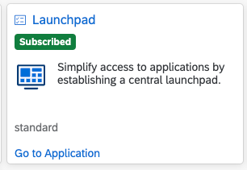 

