# Configure events in SAP SuccessFactors system

## Introduction
   Go through the necessary steps needed for preparing the SAP SuccessFactors backend.
   
   **Persona:** SAP SuccessFactors Administrator 
   **Abbreviation:** SAP Business Technology Platform = SAP BTP

## Step-by-Step

### Create Outbound OAuth Configuration

1. Login to your SAP SuccessFactors instance with your username and password.
2. In the search bar, search for Integration and Choose **Integration Center**.

   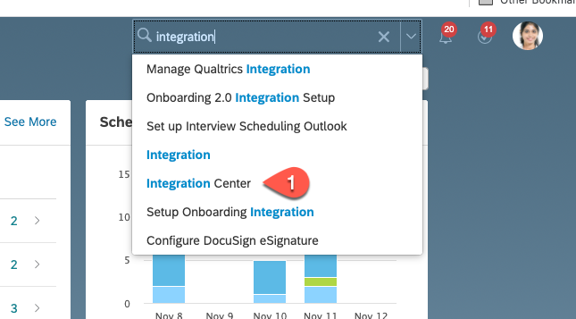

3. In the **Integration Center**, select the tile **Security Center**. If you do not find the tile **Security Center** in the Integration Center, then search for the tile **Security Center**. 

   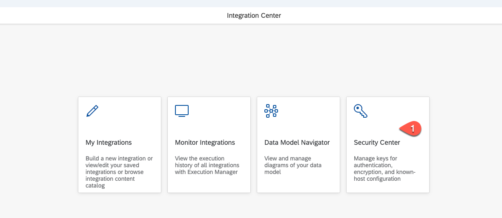

4. Choose **Outbound OAuth Configurations**.

   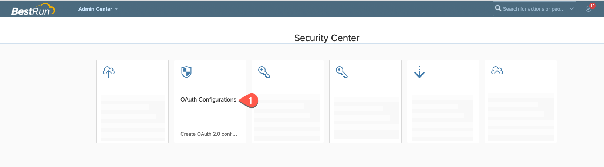
   
5. Choose **Add** to create a new OAuth configuration.

   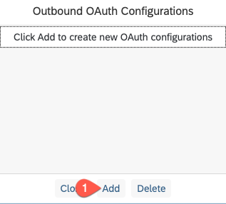
   
6. Configure the OAuth details of the Event Mesh service instance in SAP BTP. To get the service key of the Event Mesh instance, see the last step described in [Viewing service key](../ems-config/README.md#generate-service-key). Copy the values of **Client ID**, **Client Secret** and **Token endpoint** to a text editor of your choice.
 
7. In the opened screen for adding new OAuth Configuration, enter the following values:		
   - In the **Configuration Name** field enter a meaningful name, example: **SFMission**
   - In the **OAuth Type** field select **OAuth 2.0**
   - In the **Grant Type** field select **Client_Credentials**
   - In the **Client ID** field set the **Client id** of the Event Mesh instance copied in previous step
   - In the **Client secret** field enter the **Client secret** of the Event Mesh instance copied in previous step
   - In the **Token URL** field enter the **Token endpoint URL** of the Event Mesh instance copied in previous step
   - Click on **Add New Row** in Custom Parameters.
   - Enter in the key field **x-qos** and in the value field **1**
   - Save the new OAuth Configuration.
   
     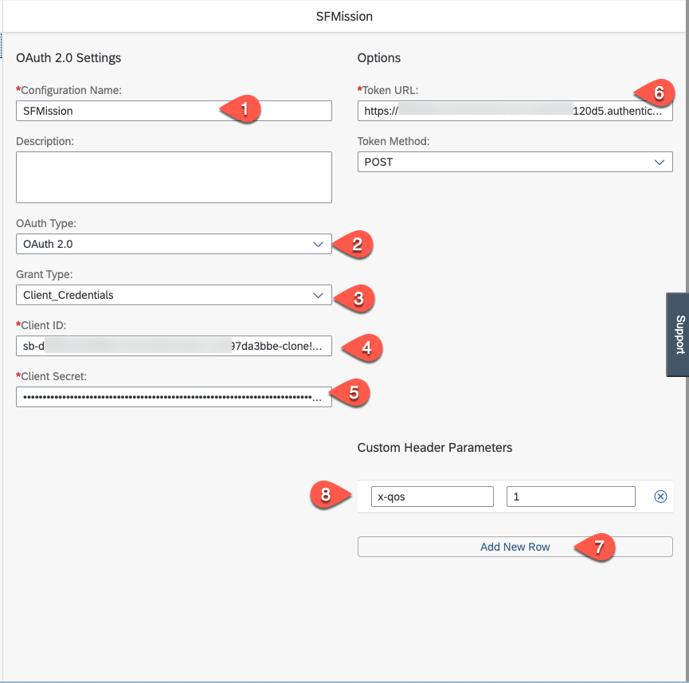

### Create new Integration Trigger Job

1. Again go back to **Integration Center** and select **My Integrations**.

   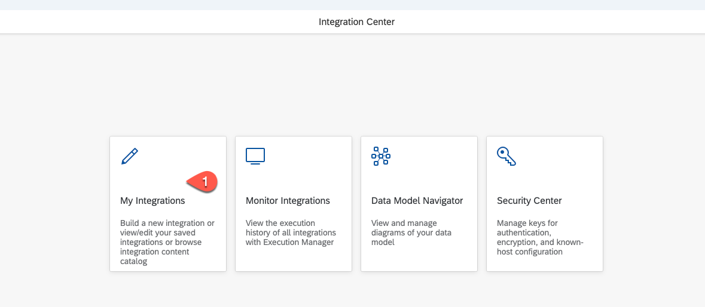
   
2. Click **+ Create** and select **More Integration Types**.

   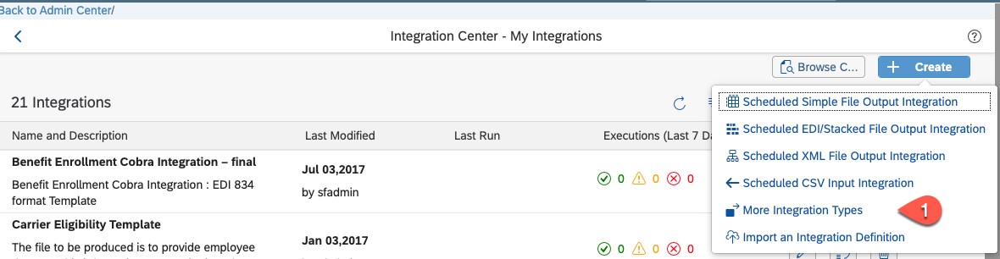
   
3. 	In the opened screen, select the following values:
   - In the Trigger type area, select the **Intelligent services** radio button
   - In the Destination type area select the **REST** radio button
   - In the Source Type area select the **SuccessFactors** radion button.
   - In the Format area  select the **JSON** radion button.
   - Choose **Create**.

     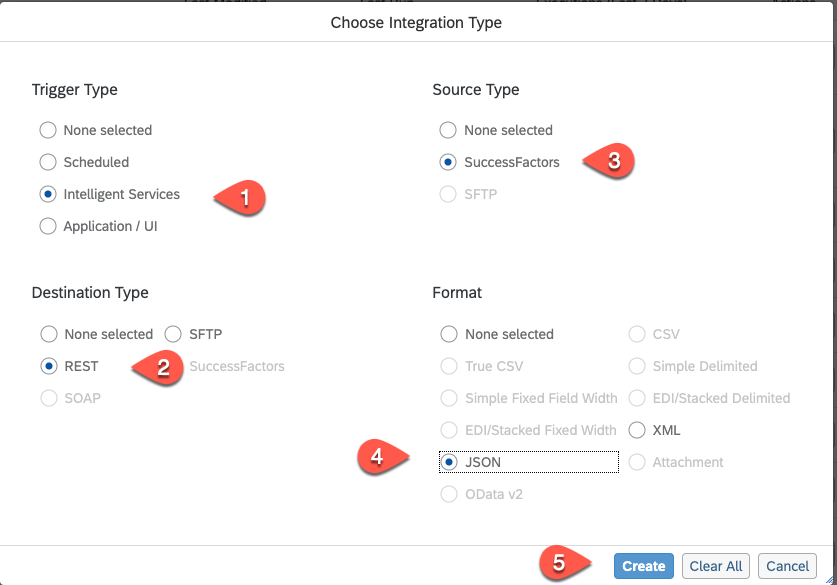
     
4. In the next page, search for the event, **Employment Termination**, select it from the list, and then choose **Select**.

   
   
5. Enter a meaningful name for **Integration Name** for example **Emp Termination** 
6. In the **Description** filed enter a meaningful text such as **SF Mission**
7. Choose **Next**.

   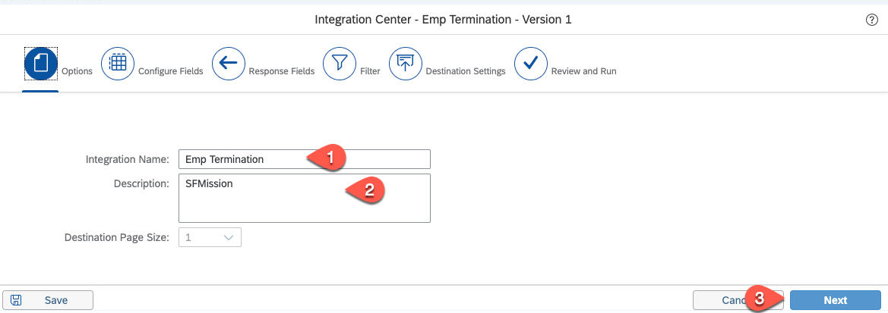
   
8. Choose **+** button to configure fields and then choose **Insert sibling element**

   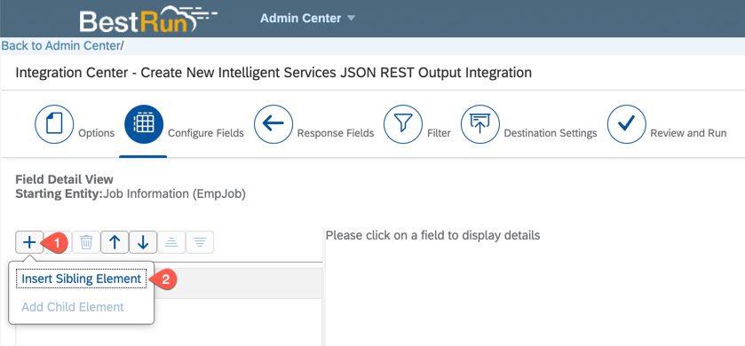
   
9. Choose the element created and in the detailed view of the element, in the Label field enter **employeeId** and then choose the button with tooltip **Set as Association Field** as shown in screenshot.

   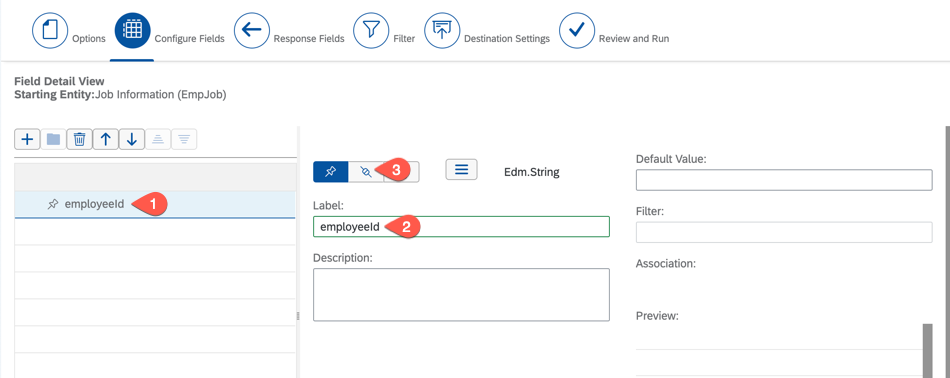
   
10. Expand the **Entity Tree View**, choose **User ID** and then choose the button **Change Association to User ID**.

   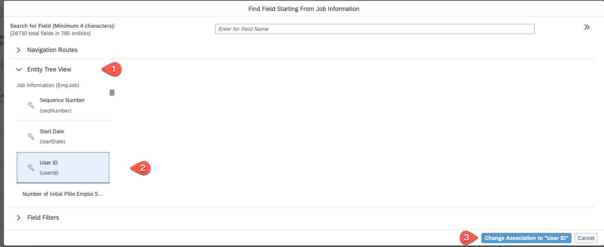
   
11. Choose the **+** to add another new field and then choose **Insert sibling element**.
12. Choose the element created and in the detailed view of the element, in the Label field, enter **managerId** and choose the button with tooltip **Set as Association Field**.

    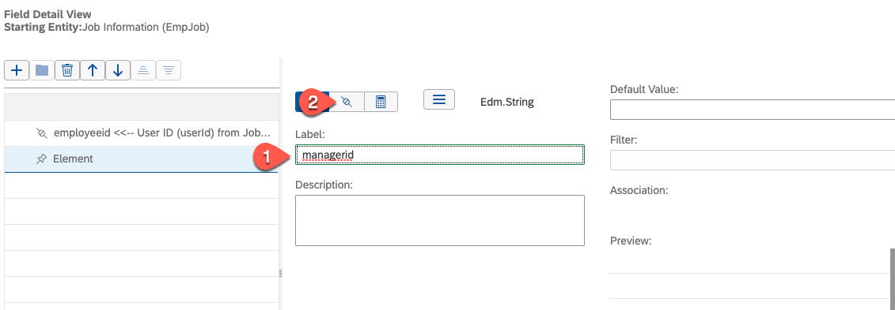
    
13. Search for **supervisor** and from the searche results list, choose **Supervisor (managerId) in Job Information (EmpJob)**
14. Expand the Entity Tree View, choose **Supervisor** and then choose **Change Association to Supervisor Id**.

    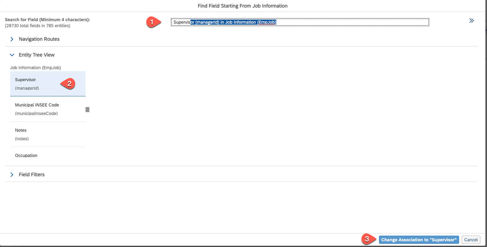
    
15. Choose **+**  + to add another field and then choose the button with tooltip **Insert sibling element**.
16. Choose the element created and in the detailed view of this element, in the Label field, enter **message** 
17. In the **Default value** field enter **Resigned**.
18. Choose **Next**.

    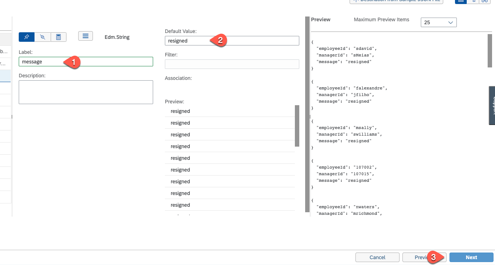
    
19. In the **Response Fields** choose **Next** without changing any configuration.
20. In the **Filter** tab choose **Next** without changing any configuration.
21. In the **Destination Settings tab:**
   - In the  **Authentication Type** field. select **OAuth**
   - in the **OAuth Configurations** field select the previously created OAuth Configuration.

   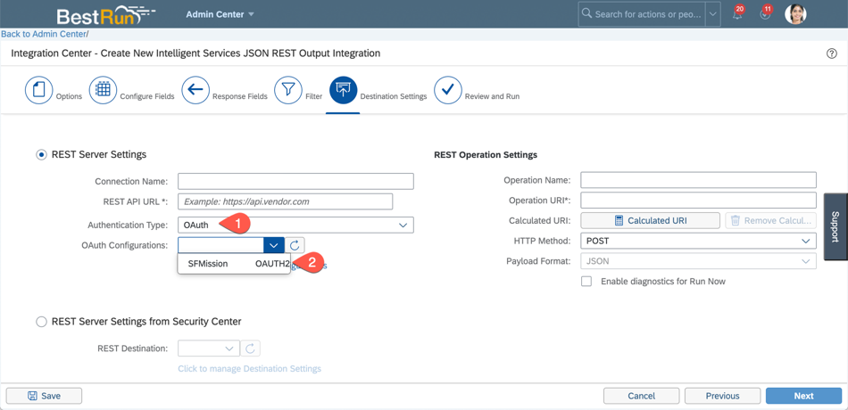
    
22. Construct the REST API URL link as shown below :
    - Give the Base url of the queue which was copied from Enterprise Message Service Key in step 4. For example for Europe Region Account it could be **`https://enterprise-messaging-pubsub.cfapps.eu10.hana.ondemand.com/messagingrest/v1/topics/<topicName>/messages`**. 
    -  Use the topic name copied from the Subscriptions in Event Mesh Application. Note that the topic name be used after double encoding. For example, if your topic name is **eccorg/sfmission/abcd/sfemessage**, then the / must be replaced with %252F. The resultant topic name will be 
**eccorg%252Fsfmission%252Fabcd%252Fsfemessage**.
    -  In the end our final URL looks like : **https://enterprise-messaging-pubsub.cfapps.eu10.hana.ondemand.com/messagingrest/v1/topics/eccorg%252Fsfmission%252Fabcd%252Fsfemessage/messages**.

   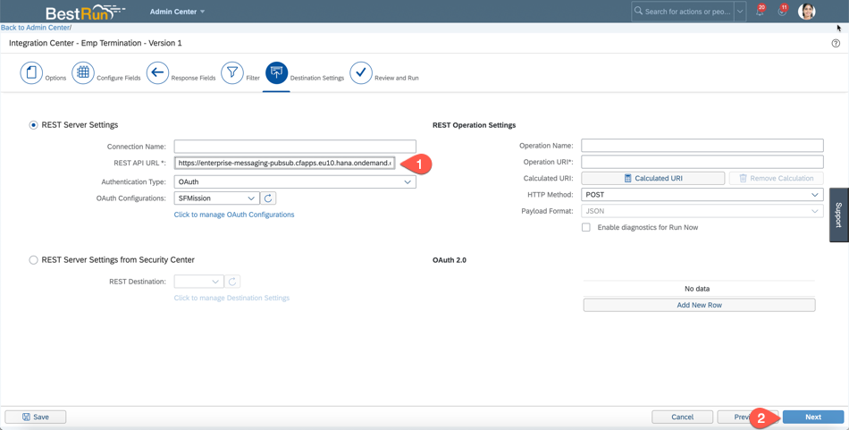 

23. Choose **Next**.
24. **Save** the configuration and if any pop up comes up, click on **Save/OK**.
    
    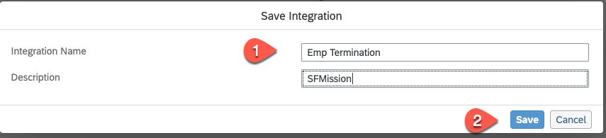
    
25. In Review and Run tab - choose **Run now**.

    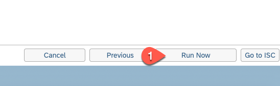
    
26. You should see a **Success** message that the integration job was submitted.

    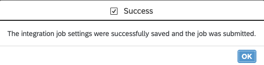

### Consume event when published 	
1. Search for **Intelligent** and choose **Intelligent Services Center(ISC)**

   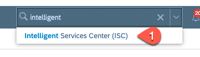
   
2. Search for **Employment** and choose the **Employment Termination** event.

   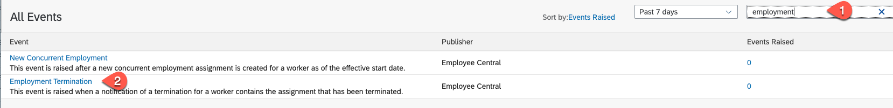
   
3. In the right side of the screen choose Custom Activities> Integration.

   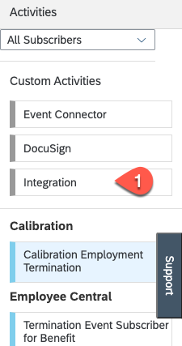
   
4. There is a popup for selecting Integration. Choose the created Integration and then choose **Add Integration**.

   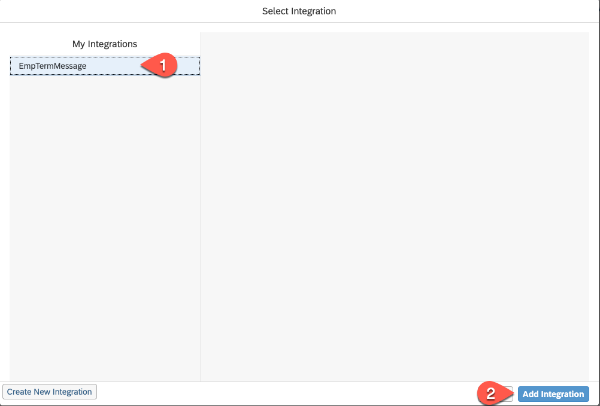
   
Now let us change the setting to consume an event when it is published.

5. Scroll down to the list and select the iIntegration just you created with source as **Integration Center** and change the **Timing** to **When event is published** from the list. 
6. Choose **Actions** (top of page).

   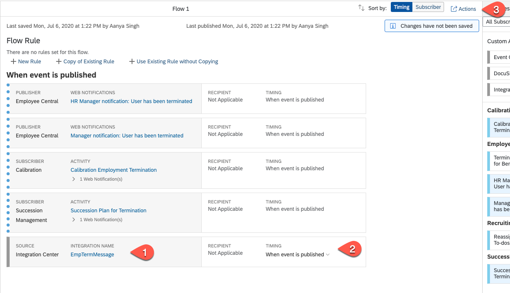
   
7. Choose **Save Flow**.

   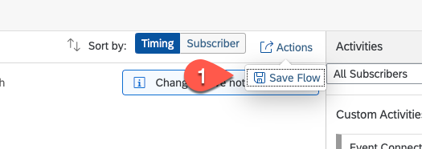	

## Summary
We have established a trust to the SAP Event Mesh service and created an integration job that is triggered when a employment termination is proceeden and puplish it via event. 
