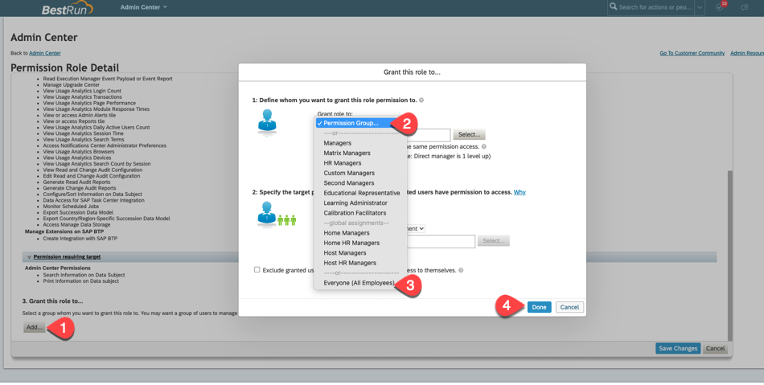
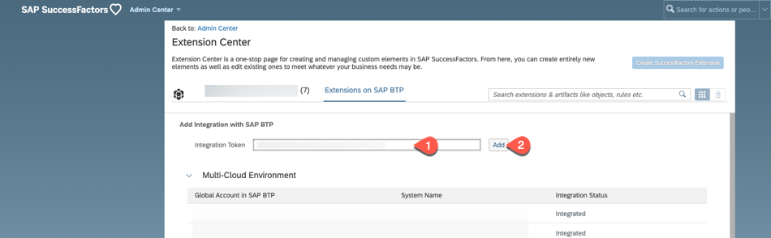
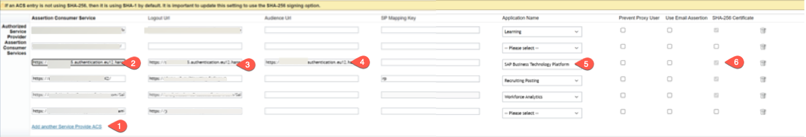

# Setup Connection and Trust between your SAP Business Technology Platform Account and the SAP SuccessFactors System

To ensure the required security for accessing the SAP Cloud extension applications, you need to configure the single sign-on (SSO) between the SAP BTP subaccount and the SAP SuccessFactors system using a SAML identity provider. The SSO requires both solutions to be configured as trusted SAML service providers for the identity provider.

For this mission we will use the Identiy Provider configured in your SAP SuccessFactors system.

Persona: 
* **Cloud Administrator for SAP BTP**
* **SAP SuccessFactors Administrator**

**Abbreviation:** SAP Business Technology Platform = SAP BTP

## Register an SAP SuccessFactors System in an SAP BTP Global Account

To connect to a SAP SuccessFactors system, you have to register this system with the SAP BTP global account.

1. Register your SAP SucessFactors System:
   * In the SAP BTP cockpit, navigate to your global account, and then choose **System Landscape** > **Systems**
   * In the **Systems** panel, choose **Register System**
   * In the **Register System** dialog box:
	  - Enter a name for the system you want to register. Note: Use only printable ASCII characters.
     - In the **Type** dropdown list, select **SAP SuccessFactors**.
     - Choose **Register**.

       
   
       SAP BTP generates an integration token that is used for triggering the automated integration on the SAP SuccessFactors company side. To use the token, you need a user with access to SAP SuccessFactors Provisioning.

2. You see a resulting **Register System** pop-up, Copy the integration token. The token is required for configuring the integration on the SAP SuccessFactors company side. The status of the SAP SuccessFactors system is now pending.
   
   
   
3. To register an SAP SuccessFactors system, open and log in to your SAP SuccessFactors company instance. 
4. In the **Admin Center** of your SAP SuccessFactors instance, if you are not using a Administrator user, check if your SuccessFactors user has sufficient roles: [Prerequisites section of this help page](https://help.sap.com/products/BTP/65de2977205c403bbc107264b8eccf4b/e956ba209f30447cb55140e38c15e345.html). 
   * For demo purposes, see the following steps to assign required roles to your user:
   * From your **SuccessFactors Admin Center**, Search and Navigate to **Manage Permission Roles**.
   * Click on **+ Create New** button.
   * Enter a **Role name** and **Description**.
   * Click on **Permission** button. The screenshots might vary depending on the version of the SAP SuccessFactors demo instance.
   
   
     
   * Under **Administrator Permissions**, select **Admin Center Permissions** and choose **Select All** on the right.

   
   
   * Similarly select **Manage Extensions on SAP BTP** and choose **Select All**
   * Also select **Metadata Framework** and choose **Configure Object Definitions** and **Admin Access to MDF OData API permissions** and choose **Done**.
   * In section **Grant this role to**, select **Add**.
   * Select **Everyone(All Employees)** in section 1. 
   * Select **Done** and choose **Save Changes**.

   

5. In the **Admin Center** search and select **Extension Center**.

   
   
6. In section **Add Integration with SAP BTP**, paste the **Integration Token** which you copied in step 2 and select **Add**. You can check the **Integration status** after you have added.

      
    
   
7. In your SAP BTP account the system should now have ths status **Registered**
   
   

## Configure Entitlement for the SAP SuccessFactors Extensibility Service

After registering the SAP SuccessFactors system in your SAP BTP global account, you have to configure an entitlement for the SAP SuccessFactors Extensibility service.

1.	In SAP BTP account cockpit, navigate to your global account and then goto your subaccount.
2.	In the navigation area, choose **Entitlements** > **Configure Entitlements** and choose **Add Service Plans**.
 
   
   

2. Select SAP SuccessFactors Extensibility. Select the SuccessFactors system you have created in the section before. Check the **api-access** plan. Press **Add 1 Service Plan**.
   
   

3. **Save** the new entitlement
   
   

## Setup Trust for SAP SuccessFactors Identity Provider

Establishing a trust is done by exchanging the SAML certificate of each system.

1. Get the SAP SuccessFactors SAML metadata file:

   * Go to **https://<sap_successfactors_system>/idp/samlmetadata?company=<company_id>&cert=sha2** where:
     - <sap_successfactors_system> is the hostname of your SAP SuccessFactors system
     - <company_id> is the ID of your SAP SuccessFactors company
     
     
     > **Note**: Check the [help page](https://help.sap.com/products/BTP/65de2977205c403bbc107264b8eccf4b/64da613776814c3f8d899686dee558ca.html) for more information.

   * Save this file on your local system and change its extension to .xml.

2. Let us register the SAP SuccessFactors identity provider in the SAP BTP cockpit.   
   - Open the SAP BTP subaccount cockpit and navigate to your subaccount.
   - Choose **Security** > **Trust Configuration**.
   - Choose **New Trust Configuration**.

     
     
3. To upload the SAML metadata you downloaded in step 1, choose **Upload**. Browse to the XML file you saved and select it. Some of the fields are automatically filled in.
   - In the **Name** field, enter a meaningful name for the trust configuration.
   - Check if the **Status** field is set to **active**.
   - **Save** the changes.
   
     
     
4. Download the service provider SAML metadata file from the SAP BTP cockpit.
   - Go to your subaccount and choose **Security** > **Trust Configuration** in the SAP BTP cockpit.
   - Choose **SAML Metadata** to download an XML file that contains the SAML 2.0 metadata describing SAP BTP as a service provider.

     
     
5. Open the XML file in a text editor and copy the following values which you will use in the next step:
   - The value of the *Location* attribute of the *AssertionConsumerService* element with the HTTP-POST binding of the XML file: this is the value of the *Assertion Consumer Service*.

     
     
   - The value of the *Location* attribute of the *SingleLogoutService* element with the HTTP-POST binding of the XML file: this is the value of the *Logout Url*.

     
     
   - The value of the *EntityID* attribute of *EntityDescriptor* element of the XML file: this is the value of the *Audience URL*.

     
   
6. In **SAP SuccessFactors Provisioning Tool**, go to your company and choose **Authorized SP Assertion Consumer Service Settings** under the **Service Provider Settings** section.

    
   
7.	Choose **Add another Service Provider ACS** and fill in the following fields:
   - **Assertion Consumer Services**: The assertion consumer service URL. This is the value of the Location attribute of the AssertionConsumerService element with the HTTP-POST binding you copied in step 5.
   - **Logout URL**: The logout URL. This is the value of the Location attribute of the SingleLogoutService element with the HTTP-POST binding you copied in step 5.
   - **Audience Url**: The audience URL. This is the value of the EntityID attribute of EntityDescriptor element you copied in step 5.
   - **Application Name**: Choose **SAP Business Technology Platform** 
   - **SHA_256 Certificate**: Check the checkbox
     
     

8.	Choose **Save**.

### Optional: Set SFSF Identity Provider as default and assign roles to SFSF user

You can set the SAP SuccessFactors Identity Provider as the 'default' Identity Provider for your applications. If not, when you open your extension application, you will be prompted to choose between the default SAP Identity Provider or the configured SuccessFactors Identity Provider. If you disable the Default Identity provider, you will have to login to all SAP BTP Services (like SAP Business Application Studio) and extension applications with your SuccessFactors IDP, so follow the steps to assign the relevant roles to your SFSF user.

1. Go back to your SAP BTP subaccount cockpit, choose **Security** > **Trust Configuration**, you have now to deactivate the default identity provider. To do that, choose **Edit** under **Actions** for the default identity provider.

   
   
2. In the popup of **Edit Trust Configuration**, for the checkbox **Available for User Logon**, deselect the option and choose **Save**, so that the default identity provider is not prompted as one of the login option for the BTP applications deployed in this subaccount. 
   
   
    

3. Map the SAP SuccessFactors user to the SAP BTP User roles. To do that, choose  **Role Collections** and click on the **Extension_App_Administrator** role collection.

    

4. Edit the **Extension_App_Administrator** role collection and enter all SAP SuccessFactors users who need the Administrator role for the extension application. Enter the SAP SuccessFactors user ID, select the SAP SuccessFactors identity provider and enter the users’ email address. **Save** the changes.
    
    

5. Repeat step 4 for the **Extension_App_Developer** role collection and add all SAP SuccessFactors users that need the Developer role.

6. In addition, you also need to add the administration users to the **Launchpad_Admin** role collection.

7. Repeat step 4 for the  **Launchpad_Admin** role collection and add all SAP SuccessFactors users that need the Launchpad Admin role.

   
   

   
   

   **Save** the changes.

   

**Result**: You have finished the system and trust setup and assigned all relevant users from your SAP SuccessFactors system.
